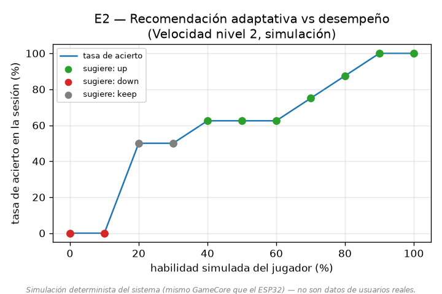
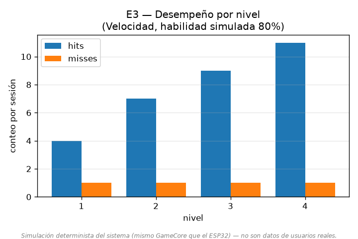
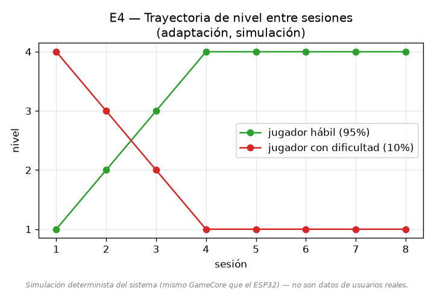

**Diseño y desarrollo de un tapete interactivo multisensorial con secuencias de luces y sonidos como herramienta de apoyo terapéutico para niños con síndrome de Down**

Andrés Mauricio Restrepo Restrepo, Christian Camilo Galeano Saldarriaga

Director: Luis Carlos Rodríguez Timaná

*Programa de Ingeniería Electrónica, Facultad de Ingeniería*

*Universidad Santiago de Cali, Cali, Colombia*

andres.restrepo03@usc.edu.co · christian.galeano01@usc.edu.co

**Resumen**

El síndrome de Down es una condición genética la cual se relaciona con alteraciones en el desarrollo motor y cognitivo, especialmente en áreas como el equilibrio, la coordinación, la memoria de trabajo y la planificación motora. Es por esto que estas dificultades pueden limitar la autonomía y la participación activa de los niños en espacios educativos y terapéuticos, por lo que es necesario implementar estrategias de intervención innovadoras que complementen y ayuden a las terapias tradicionales. Cabe resaltar que las tecnologías interactivas y los juegos se han convertido en una herramienta prometedora para la estimulación multisensorial y el fortalecimiento de habilidades cognitivas y motoras. Teniendo en cuenta lo mencionado anteriormente, este artículo presenta el diseño y desarrollo de un tapete interactivo multisensorial que combina secuencias de luces y sonidos como herramienta de apoyo terapéutico para niños con síndrome de Down. El sistema integra sensores de presión, iluminación LED y un microcontrolador ESP32, permitiendo la ejecución de dinámicas de juego orientadas a estimular la memoria de trabajo, la planificación motora, la velocidad de respuesta y el equilibrio. Adicionalmente, se incorpora un software de monitoreo en PC que registra variables como tiempos de respuesta, aciertos y errores, facilitando el análisis del comportamiento funcional del prototipo. La validación de la lógica del sistema se realizó mediante una simulación determinista —ejecutando un jugador simulado contra el mismo núcleo de software que gobierna el prototipo—, enfocándose en la reproducibilidad y en el comportamiento de la dificultad adaptativa, sin realizar pruebas con pacientes ni mediciones de impacto clínico; la validación funcional de banco sobre el hardware (latencia del lazo de interacción y fiabilidad de detección de los sensores) se plantea como continuación, una vez completado el montaje del prototipo. Los resultados de simulación evidencian que la lógica de dificultad adaptativa responde de forma coherente al desempeño, lo que respalda la viabilidad técnica del sistema y destaca su potencial como herramienta tecnológica complementaria para apoyar procesos terapéuticos en niños con síndrome de Down.

**Palabras clave**

Síndrome de Down; tapete interactivo; juegos serios; estimulación multisensorial; sensores de presión; ESP32; habilidades motoras; funciones ejecutivas; tecnología de apoyo terapéutico.

**Abstract**

Down syndrome is a genetic condition associated with alterations in motor and cognitive development, particularly in areas such as balance, coordination, working memory, and motor planning. These difficulties can limit children's autonomy and active participation in educational and therapeutic settings, which makes it necessary to implement innovative intervention strategies that complement traditional therapies. Interactive technologies and serious games have emerged as a promising tool for multisensory stimulation and for strengthening cognitive and motor skills. This article presents the design and development of a multisensory interactive mat that combines light and sound sequences as a therapeutic support tool for children with Down syndrome. The system integrates pressure sensors, LED lighting, and an ESP32 microcontroller, enabling game dynamics aimed at stimulating working memory, motor planning, response speed, and balance. A PC monitoring application was also incorporated to record variables such as response times, hits, and errors, supporting the analysis of the prototype's functional behavior. The system logic was validated through a deterministic simulation —running a simulated player against the same software core that governs the prototype—, focusing on reproducibility and adaptive-difficulty behavior, without conducting tests with patients or clinical-impact measurements; functional bench validation on the hardware (interaction-loop latency and sensor-detection reliability) is planned as a continuation, once the prototype assembly is completed. The simulation results show that the adaptive-difficulty logic responds coherently to performance, supporting the technical feasibility of the system and highlighting its potential as a complementary technological tool to support therapeutic processes in children with Down syndrome.

**Keywords:** Down syndrome; interactive mat; serious games; multisensory stimulation; pressure sensors; ESP32; motor skills; executive functions; assistive therapeutic technology.

**1. Introducción**

El síndrome de Down, también conocido como trisomía 21, se produce cuando existe una copia adicional del cromosoma 21 en todas las células del individuo. Es considerado uno de los trastornos genéticos más prevalentes a nivel global, con una tasa de ocurrencia estimada de 12,6 por cada 10.000 nacimientos (de Graaf et al., 2015). Los niños que presentan esta condición suelen evidenciar una disminución en la fuerza muscular y alteraciones en el funcionamiento del cerebelo, lo que compromete su equilibrio y control postural. Como consecuencia, su patrón de marcha se torna inestable y se caracteriza por pasos más cortos, derivando en un retraso en el desarrollo de habilidades motoras gruesas (Okada et al., 2019).

A nivel cognitivo, estos niños suelen presentar dificultades en funciones ejecutivas como la memoria de trabajo, la atención y la planificación, lo que repercute directamente en su capacidad para seguir instrucciones, recordar secuencias y comprender información compleja, afectando tanto su desempeño en actividades cotidianas como en contextos educativos (Lukowski et al., 2019; Covaci et al., 2015). Asimismo, la velocidad de procesamiento y reacción suele estar disminuida, dificultando la interacción en actividades que requieren rapidez en la toma de decisiones.

A pesar de la existencia de terapias motoras y juegos tradicionales, muchos de estos métodos carecen de la capacidad de proporcionar retroalimentación inmediata y personalizada. La falta de un seguimiento detallado del progreso del niño dificulta la adaptación de los niveles de dificultad, lo que puede resultar en frustración y desmotivación (Okada et al., 2019; Minh et al., 2021). En contraste, los juegos serios ofrecen un gran potencial terapéutico para personas con neurodiversidad, mejorando sus funciones ejecutivas y promoviendo la inclusión tanto en entornos educativos como terapéuticos (Timaná et al., 2024).

En este contexto, el presente trabajo propone el diseño y desarrollo de un tapete interactivo multisensorial que combina secuencias de luces y sonidos, sensores de presión y un software de análisis en PC, con el fin de estimular las habilidades cognitivas y motoras de los niños con síndrome de Down. El sistema ofrece distintos modos de juego diseñados para trabajar la memoria de trabajo, la planificación motora, la velocidad de respuesta y el equilibrio, proporcionando retroalimentación inmediata y registrando indicadores de desempeño que facilitan el acompañamiento terapéutico.

De esta manera, el proyecto aborda el desarrollo técnico del dispositivo y la validación de su comportamiento funcional mediante simulación determinista de su lógica y pruebas de banco sobre el prototipo. Así, se plantea como pregunta de investigación: ¿cuáles son los elementos clave en el desarrollo de un tapete interactivo con luces y sonidos que favorezcan su efectividad como herramienta de apoyo terapéutico para niños con síndrome de Down? Para responderla, se definió como objetivo general desarrollar un tapete interactivo que combine secuencias de luces y sonidos como herramienta de apoyo en terapias para niños con síndrome de Down, y como objetivos específicos: (i) diseñar el sistema electrónico que integra sensores de presión, módulos de iluminación LED y componentes de salida de audio; (ii) desarrollar el firmware del microcontrolador encargado de la interacción entre sensores, luces y sonidos, implementando diferentes modos terapéuticos adaptables; y (iii) validar el comportamiento funcional del prototipo mediante simulación determinista de su lógica y pruebas de banco.

**2. Marco teórico**

**2.1. Síndrome de Down y su impacto en el desarrollo infantil**

El síndrome de Down es un trastorno genético causado por la presencia de una copia adicional del cromosoma 21. Esta condición afecta múltiples áreas del desarrollo infantil, tanto físico como cognitivo. En el plano físico, es común observar hipotonía muscular, laxitud ligamentosa y retraso en el desarrollo motor grueso, lo que repercute en habilidades como el equilibrio y la coordinación. A nivel cognitivo, se presentan dificultades en funciones como la memoria de trabajo, la atención y la planificación, lo que puede impactar el aprendizaje y la autonomía del niño en contextos escolares y sociales (Okada et al., 2019).

Las alteraciones motoras, derivadas principalmente de la hipotonía y de las dificultades de equilibrio, se traducen en una marcha inestable y en retrasos en el desarrollo motor grueso, afectando no solo la movilidad sino también la independencia funcional y la interacción con el entorno (Okada et al., 2019; Galli et al., 2008). Frente a ello, diversas terapias, como la fisioterapia y la hipoterapia, han demostrado beneficios importantes: mientras la fisioterapia mejora la alineación corporal y fortalece el sistema musculoesquelético, la hipoterapia estimula el sistema vestibular y la orientación espacial, promoviendo un desarrollo motor más equilibrado (Bevilacqua Junior et al., 2023).

**2.2. Habilidades motoras: clasificación y evaluación**

Las habilidades motoras pueden definirse como secuencias aprendidas de movimientos que se combinan de manera coordinada para ejecutar una acción de forma suave, precisa y eficiente. Estas habilidades no son innatas, sino que se adquieren y refinan progresivamente a través de la práctica, la retroalimentación y la maduración del sistema neuromuscular (van der Fels et al., 2015). Su desarrollo es fundamental para la autonomía del individuo, ya que permiten desde acciones básicas como caminar o alimentarse, hasta tareas más complejas como escribir, jugar o manipular objetos.

Estas habilidades se agrupan en distintas categorías funcionales: habilidades motoras gruesas (correr, saltar, caminar, equilibrio), finas (escritura, dibujo, manipulación precisa), de coordinación bilateral (sincronización de extremidades superiores e inferiores), de control de objetos (lanzar, atrapar o manejar herramientas) y de rendimiento cronometrado (velocidad de ejecución de secuencias motoras), además de una puntuación motora total que integra todas las anteriores (van der Fels et al., 2015). Debido a la hipotonía y la disfunción neuromuscular, los niños con síndrome de Down suelen presentar dificultades en varias de estas categorías, por lo que resulta necesario implementar estrategias lúdicas y terapéuticas para su fortalecimiento.

**2.3. Habilidades cognitivas y funciones ejecutivas**

Las habilidades cognitivas se entienden como las acciones mentales o procesos de adquisición de conocimiento y comprensión a través del pensamiento, la experiencia y los sentidos. Dentro de ellas, las funciones ejecutivas se describen como habilidades cognitivas de orden superior que permiten el autocontrol y la regulación del comportamiento (van der Fels et al., 2015). Entre las funciones ejecutivas más relevantes se encuentran la inhibición de respuesta (control de impulsos), la planificación (estructuración de pasos para alcanzar un objetivo), la atención (focalización en estímulos relevantes) y la memoria de trabajo (retención y manipulación de información por períodos breves).

Los niños con síndrome de Down suelen presentar dificultades en estas funciones ejecutivas, lo que puede afectar su desempeño académico y su autonomía diaria. Por ello, la estimulación cognitiva resulta clave para favorecer su desarrollo integral, especialmente cuando se combina con estrategias que promuevan la motivación y la participación activa.

**2.4. Juegos serios como herramienta de intervención**

Los juegos serios combinan el entretenimiento con objetivos pedagógicos o terapéuticos, integrando dinámicas lúdicas con finalidades formativas o de intervención. A diferencia de los videojuegos convencionales, cuyo propósito principal es el ocio, los juegos serios están diseñados intencionalmente para desarrollar o fortalecer habilidades específicas, ya sean de tipo cognitivo, motor, emocional o social (Timaná et al., 2024). Gracias a su componente interactivo y personalizado, favorecen la participación activa, el aprendizaje significativo y la repetición voluntaria de tareas.

En el caso de niños con neurodiversidad como el síndrome de Down, los juegos serios han mostrado resultados positivos en la estimulación de funciones ejecutivas y en el desarrollo de habilidades motoras, al ofrecer un entorno seguro, motivador y adaptado (Timaná et al., 2024). Su componente lúdico fomenta la motivación intrínseca, favoreciendo la repetición de tareas motrices y cognitivas sin generar frustración, lo que se traduce en mejoras tanto en la coordinación como en la atención y la memoria de trabajo. La combinación de enfoques terapéuticos tradicionales con herramientas innovadoras como los juegos serios ofrece, por tanto, una vía prometedora para intervenir las áreas motoras y cognitivas en esta población.

**3. Estado del arte**

La revisión de la literatura evidencia un creciente interés en el uso de tecnologías interactivas y multisensoriales como apoyo a la rehabilitación de niños con discapacidad. A continuación se describen los trabajos más representativos identificados.

**3.1. VIC: interfaz tangible para entrenar la memoria**

Beccaluva et al. (2022) presentan VIC, una interfaz de usuario tangible e inteligente diseñada para mejorar habilidades específicas de memoria en niños con discapacidad intelectual, enfocándose en la memoria sensorial o auditiva, la memoria a corto plazo y la memoria de trabajo o visoespacial. El sistema, modular, consta de un tablero con sensores y nueve cubos digitales que emiten luces y sonidos en respuesta a la manipulación y posición de los cubos. Los resultados preliminares indican que VIC es fácil de usar, atractivo y genera compromiso en los usuarios, aspectos considerados requisitos clave para futuras investigaciones que evalúen su eficacia clínica.

**3.2. Entornos multisensoriales para la propiocepción**

Valencia-Jimenez et al. (2023) investigaron los efectos de un protocolo de intervención basado en un entorno multisensorial (EMS) diseñado para mejorar la propiocepción en niños con síndrome de Down, empleando un sistema basado en cámaras RGB-D para evaluar el desempeño funcional. En un estudio piloto con tres niños, con una edad promedio de nueve años, que participaron en doce sesiones de juego terapéutico, se observó una mejora significativa en el perfil psicomotor: la puntuación promedio pasó de 10,43 a 16,44, lo que sugiere que el EMS puede ser una herramienta eficaz para mejorar la propiocepción, con un impacto positivo en el desarrollo motor y funcional.

**3.3. Tapete interactivo para motricidad gruesa**

Bernal Díaz et al. (2019) diseñaron un tapete interactivo orientado a mejorar las habilidades de coordinación motriz gruesa en niños con discapacidad intelectual. El tapete utiliza un microcontrolador Arduino y cuenta con cinco botones luminosos; cuando una luz se enciende, el niño identifica el botón correspondiente y lo pisa, trabajando así su equilibrio y motricidad gruesa, mientras el sistema proporciona retroalimentación visual sobre la corrección de la acción. El diseño demostró favorecer una mayor independencia en los niños y facilitar su integración social a través del juego con sus pares.

**3.4. Juguetes interactivos para parálisis cerebral**

Minh et al. (2021) diseñaron dos juguetes interactivos para apoyar la rehabilitación de la extremidad superior en niños de 2 a 5 años, utilizando un juego 2D libre y sin reglas. Mediante un palo con sensores de movimiento y un guante con sensores de fuerza, los juguetes rastreaban los movimientos de hombro y la fuerza de agarre, motivando la repetición de los movimientos de rehabilitación. Los niños mostraron mejoras en cinco días, lo que evidenció que la solución era factible y entretenida. Por su parte, Bian et al. (2020) desarrollaron juguetes modulares compatibles con bloques LEGO que utilizan colores vibrantes, diseños de animales y retroalimentación visual y auditiva para entrenar manos y brazos, con piezas intercambiables que permiten ajustar la dificultad de los ejercicios.

**3.5. Síntesis**

Los estudios revisados evidencian el impacto positivo de las tecnologías interactivas y multisensoriales en el desarrollo de habilidades motoras y cognitivas en niños con discapacidad. Herramientas como VIC, los entornos multisensoriales y los juguetes interactivos han mostrado ser efectivas para mejorar la memoria, la coordinación motriz y la propiocepción, al tiempo que motivan a los niños mediante un enfoque lúdico. Estos resultados destacan su capacidad para promover la participación, contribuyendo al desarrollo, la autonomía y la integración social, y abren nuevas oportunidades para la rehabilitación y la inclusión, como el uso de tapetes multisensoriales que permiten la intervención mientras los pacientes juegan.

**4. Metodología**

El proyecto propone el desarrollo de un tapete interactivo que incorpora elementos lúdicos y terapéuticos diseñados específicamente para estimular las áreas de desarrollo cognitivo y motor que presentan dificultades en los niños con síndrome de Down. El tapete se basa en principios de aprendizaje multisensorial, utilizando estímulos visuales y auditivos para crear una experiencia inmersiva y atractiva, con diferentes niveles de dificultad que buscan que las actividades sean siempre desafiantes pero alcanzables, y que proporcionan retroalimentación inmediata sobre el desempeño del niño. El desarrollo se organizó en tres fases principales que se describen a continuación.

**4.1. Diseño del sistema electrónico**

Para el prototipo se emplearon componentes de fácil integración. Como unidad de procesamiento se utilizó un módulo de desarrollo basado en el microcontrolador ESP32, dispositivo versátil y de bajo consumo que integra conectividad Wi-Fi y Bluetooth, capacidad de procesamiento local y múltiples interfaces de entrada/salida (GPIO, I²C, SPI, ADC), lo que lo hace idóneo para adquirir, procesar y transmitir los datos generados por el sistema. Para la detección de las pisadas se incorporaron sensores de presión tipo FSR (Force Sensitive Resistor), cuya resistencia eléctrica disminuye al aumentar la fuerza aplicada; son flexibles, económicos y fáciles de integrar, por lo que resultan adecuados para detectar la pisada del niño en cada casilla del tapete.

Para la retroalimentación visual se emplearon módulos de iluminación LED de luz blanca controlados por modulación de ancho de pulso (PWM). Cada casilla del tapete dispone de un grupo de LEDs cuya intensidad se regula por software para brindar retroalimentación inmediata ante la pisada, indicar turnos, señalar instrucciones o representar estados del juego; los efectos de iluminación dinámica (transiciones, parpadeos o secuencias) ayudan a mantener la atención y a reforzar el aprendizaje. La elección de iluminación de luz blanca por PWM, frente a tiras de LED RGB direccionables, responde a tres criterios de ingeniería: (a) accesibilidad —la retroalimentación del tapete se sustenta en la posición de la casilla encendida y en su estado (encendido/apagado e intensidad), no en la discriminación de color, evitando excluir a usuarios con alteraciones en la percepción cromática; (b) robustez —el control PWM de intensidad por grupo de LEDs es más simple y tolerante que el protocolo temporizado que requieren las tiras direccionables, lo que reduce los puntos de fallo en un dispositivo destinado al uso repetido por niños; y (c) costo y disponibilidad de componentes. La lógica de juego es independiente del tipo de LED empleado: el firmware expone una abstracción de hardware (encender, apagar y regular intensidad por casilla), de modo que una futura migración a iluminación de color no exigiría modificar la lógica de los modos.

Para la salida de audio se integró un módulo DFPlayer Mini con altavoces de pequeño tamaño, con el fin de emitir sonidos motivadores, efectos de refuerzo positivo, instrucciones verbales y pistas auditivas que se adaptan al modo de juego seleccionado, fortaleciendo la asociación entre acción, estímulo y respuesta. El tapete se confecciona con un material suave y estampados amigables, y se alimenta mediante una batería recargable de litio que permite su portabilidad.

**4.2. Sistema de monitoreo en PC**

El sistema cuenta con conectividad Wi-Fi para permitir la comunicación entre el microcontrolador ESP32 y la interfaz de monitoreo en la PC, facilitando el almacenamiento de datos y el seguimiento del desempeño del usuario en tiempo real. El ESP32 se configura para conectarse a una red Wi-Fi, estableciendo un protocolo de comunicación eficiente y confiable que garantiza la transmisión correcta de los datos recolectados por los sensores hacia el software de análisis. Dicho software, desarrollado en Python, permite visualizar el desempeño del niño, gestionar su progreso y realizar ajustes personalizados en la dificultad de los juegos, brindando a terapeutas y padres herramientas útiles para el acompañamiento y el seguimiento terapéutico.

**4.3. Modos de juego**

El sistema integra tres modos de juego diseñados para estimular distintas habilidades cognitivas y motoras. La Tabla 1 resume cada modo, la habilidad principal que estimula y su dinámica de interacción.

*Tabla 1. Modos de juego del tapete interactivo.*

| Modo | Habilidad estimulada | Dinámica de interacción |
|---|---|---|
| Memoria de secuencias | Memoria de trabajo y planificación motora | El tapete muestra una secuencia de casillas iluminadas que el niño debe observar y luego repetir pisando en el mismo orden; la longitud de la secuencia aumenta según el nivel. |
| Velocidad de respuesta | Velocidad de procesamiento y reacción | Una casilla se ilumina de forma aleatoria y el niño debe pisarla lo más rápido posible dentro de una ventana de tiempo; el sistema registra el tiempo de reacción. |
| Equilibrio y coordinación | Coordinación bilateral y control postural | Se iluminan varias casillas en un patrón que el niño debe pisar para mantener el equilibrio, trabajando la coordinación de extremidades y el control postural. |

Un elemento central del firmware es la **lógica de dificultad adaptativa**: a partir del desempeño observado en cada sesión (aciertos, errores y tiempos), el sistema recomienda subir, mantener o bajar el nivel de dificultad, de modo que la actividad permanezca desafiante pero alcanzable.

**4.4. Protocolo de validación**

La validación del prototipo se estructuró en dos niveles complementarios, ninguno de los cuales involucró pruebas con pacientes.

**4.4.1. Validación de la lógica por simulación determinista.** La lógica de los modos de juego se implementó como un núcleo de software portable: el mismo código que ejecuta el microcontrolador se compila también como una biblioteca que puede ejercitarse en la PC. Sobre esta biblioteca se ejecutó un *jugador simulado* parametrizado por una *habilidad* (probabilidad de acertar la casilla correcta dentro de la ventana de tiempo). El jugador reacciona a los eventos de iluminación que emite el núcleo y registra los aciertos, los errores y las recomendaciones de nivel generadas por el sistema. Dado que el generador de números pseudoaleatorios del sistema es determinista y reproducible (semilla fija), cada configuración (modo, nivel, semilla, habilidad) produce exactamente la misma secuencia de eventos, lo que permite obtener evidencia reproducible del comportamiento del sistema. Esta estrategia se aplicó en el presente trabajo al modo de velocidad de respuesta.

**4.4.2. Validación funcional de banco.** Sobre el prototipo físico se contempla la medición de la latencia del lazo pisada→retroalimentación y de la fiabilidad de detección de los sensores FSR (umbral de activación), capturadas a través del software de monitoreo en PC conectado al microcontrolador.

Los parámetros de validación se resumen en seis evidencias: la reproducibilidad de la lógica (E1), el seguimiento de la dificultad adaptativa frente al desempeño (E2), el comportamiento por nivel (E3) y la evolución del nivel entre sesiones simuladas (E4) —obtenidas por simulación determinista—, y la latencia del lazo de interacción (E5) y la fiabilidad de detección de los sensores (E6) —por obtener en banco—. La evaluación del impacto terapéutico con pacientes, que requeriría un protocolo clínico con aprobación de comité de ética, consentimiento informado y seguimiento longitudinal, no se aborda en este trabajo y se plantea como trabajo futuro (sección 6); el alcance se centra en la viabilidad técnica y funcional del dispositivo.

**5. Resultados**

Los resultados se organizan según las fuentes de evidencia disponibles. Las secciones 5.1 a 5.4 corresponden a la validación de la lógica por simulación determinista (evidencias E1–E4), reproducibles a partir del software del proyecto. La sección 5.5 corresponde a la validación funcional de banco (E5–E6), cuya captura depende del prototipo físico instrumentado.

> Las figuras de esta sección representan el comportamiento del sistema en **simulación determinista**; no constituyen resultados obtenidos con pacientes. Todas las cifras reportadas se generan de forma reproducible a partir de una semilla fija.

**5.1. Reproducibilidad de la lógica (E1)**

Dos ejecuciones independientes de una misma sesión (modo velocidad de respuesta, nivel 2, semilla fija, habilidad máxima) produjeron secuencias de eventos y recomendaciones de nivel idénticas, confirmando el determinismo del núcleo de software. Esta propiedad es la base de la trazabilidad de las demás evidencias: cualquier figura o cifra puede regenerarse exactamente a partir de su semilla.

**5.2. Dificultad adaptativa frente al desempeño (E2)**

Se ejecutó un barrido de la habilidad del jugador simulado de 0 % a 100 % en el nivel 2. La tasa de acierto de la sesión creció de forma monótona con la habilidad: 0 % para habilidades de 0–10 %, 50 % para 20–30 %, entre 62,5 % y 87,5 % para 40–80 %, y 100 % para 90–100 %. La recomendación de nivel emitida por el sistema siguió coherentemente al desempeño: sugirió **bajar** el nivel para habilidades de 0–10 %, **mantenerlo** para 20–30 % y **subirlo** a partir del 40 %. Esto evidencia que el mecanismo de adaptación responde al desempeño observado en la dirección esperada (Figura 1).

*Figura 1. Recomendación adaptativa frente al desempeño (modo velocidad, nivel 2). La curva muestra la tasa de acierto según la habilidad; el color de cada punto indica la recomendación del sistema (bajar/mantener/subir). Simulación determinista.*

**5.3. Comportamiento por nivel (E3)**

Para una habilidad fija del 80 %, se evaluaron los cuatro niveles del modo de velocidad. El número de rondas por sesión crece con el nivel (5, 8, 10 y 12 rondas para los niveles 1 a 4), mientras que el desempeño del jugador simulado se mantiene estable (un error por sesión en los cuatro niveles, acorde con la habilidad fijada). Esto confirma que el nivel controla de forma predecible la longitud y la exigencia de la sesión, manteniendo constante la mecánica de juego (Figura 2, Tabla 2).

*Figura 2. Aciertos y errores por nivel (modo velocidad, habilidad 80 %). Simulación determinista.*

*Tabla 2. Indicadores de la lógica por nivel en simulación determinista (modo velocidad, habilidad 80 %).*

| Nivel | Rondas | Aciertos | Errores |
|---|---|---|---|
| 1 | 5 | 4 | 1 |
| 2 | 8 | 7 | 1 |
| 3 | 10 | 9 | 1 |
| 4 | 12 | 11 | 1 |

**5.4. Evolución del nivel entre sesiones (E4)**

Encadenando sesiones y aplicando en cada una la recomendación de nivel, un jugador hábil (habilidad 95 %) que inicia en el nivel 1 escala progresivamente hasta el nivel máximo (1→2→3→4) y se estabiliza, mientras que un jugador con dificultad (habilidad 10 %) que inicia en el nivel 4 desciende hasta el nivel mínimo (4→3→2→1) y se estabiliza. Esto demuestra la convergencia del nivel de dificultad hacia el desempeño del usuario (Figura 3).

*Figura 3. Trayectoria del nivel a lo largo de sesiones sucesivas para un jugador hábil y uno con dificultad. Simulación determinista.*

**5.5. Validación funcional de banco (E5–E6)**

La medición de la latencia del lazo pisada→retroalimentación (E5) y de la fiabilidad de detección de los sensores FSR, incluyendo la calibración del umbral de activación (E6), se realiza sobre el prototipo físico instrumentado y se captura mediante el software de monitoreo. Estas evidencias se incorporarán una vez completado el montaje y la calibración del hardware; el software de adquisición y registro necesario para obtenerlas ya se encuentra disponible. *(Sección pendiente de datos de banco.)*

**5.6. Trazabilidad objetivo–evidencia**

La Tabla 3 relaciona cada objetivo específico con la evidencia que lo respalda y su estado de validación.

*Tabla 3. Trazabilidad de objetivos específicos a evidencias.*

| Objetivo específico | Evidencia asociada | Estado |
|---|---|---|
| (i) Diseñar el sistema electrónico (FSR, iluminación LED, audio) | Diagrama de conexiones y prototipo de banco; E6 (detección FSR) | Diseño completo; banco en montaje y calibración |
| (ii) Firmware con tres modos terapéuticos adaptables | Núcleo de software portable; E1–E4 (modo velocidad) | Modo velocidad validado en simulación; modos de memoria y equilibrio implementados, con validación análoga pendiente |
| (iii) Validar el comportamiento funcional del prototipo | E1–E4 (simulación) y E5–E6 (banco) | E1–E4 completas; E5–E6 al completar el montaje |

**6. Análisis de resultados**

Los resultados obtenidos permiten establecer conclusiones sobre la viabilidad técnica y funcional del tapete interactivo. La reproducibilidad de la lógica (E1) garantiza que el comportamiento del sistema es determinista y auditable, condición necesaria para que cualquier evidencia funcional sea verificable. Sobre esa base, las evidencias E2, E3 y E4 muestran que la lógica de dificultad adaptativa cumple su función de diseño: la recomendación de nivel sigue al desempeño en la dirección esperada (E2), el incremento de nivel se traduce en sesiones más exigentes sin degradar la respuesta del sistema (E3), y el nivel de dificultad converge hacia el desempeño del usuario a lo largo de sesiones sucesivas (E4). En conjunto, esto confirma que la arquitectura propuesta —basada en el microcontrolador ESP32, sensores FSR, iluminación LED y salida de audio— es adecuada para sostener dinámicas de juego adaptativas y que el mecanismo de adaptación responde de forma coherente al desempeño.

La capacidad de adaptar automáticamente la dificultad al desempeño —ausente en muchas terapias y juegos tradicionales (Okada et al., 2019; Minh et al., 2021)— se presenta como uno de los elementos clave de la propuesta, en línea con lo reportado por la literatura sobre juegos serios (Timaná et al., 2024) y con los criterios de usabilidad y compromiso identificados en trabajos previos como VIC (Beccaluva et al., 2022) y los tapetes interactivos para motricidad gruesa (Bernal Díaz et al., 2019). De esta manera, el prototipo se ubica en la misma línea de las soluciones tecnológicas que han demostrado potencial para apoyar la rehabilitación y la inclusión de niños con discapacidad.

No obstante, es importante reconocer las limitaciones de este trabajo. La validación se realizó mediante simulación determinista de la lógica de juego, sin pruebas con usuarios; por tanto, no es posible afirmar nada sobre la experiencia de uso real, la aceptación por parte de los niños ni el impacto cognitivo o motor del sistema. La evidencia de simulación se obtuvo, además, para el modo de velocidad de respuesta; los modos de memoria y equilibrio, aunque implementados, requieren una validación análoga. Finalmente, las evidencias de banco (latencia y fiabilidad de detección) dependen de la finalización del montaje físico.

Como trabajo futuro se plantean tres líneas. Primero, completar la validación funcional de banco (E5–E6) y extender la validación por simulación a los modos de memoria y equilibrio. Segundo, realizar una evaluación de usabilidad e interacción usuario-dispositivo con la participación de niños con síndrome de Down en un entorno terapéutico, estructurada en fases de familiarización y uso progresivo, con seguimiento cualitativo a docentes y padres; esta evaluación requeriría la aprobación de un comité de ética y el consentimiento informado de los participantes, y permitiría valorar la usabilidad y la motivación generada por el dispositivo. Tercero, y a más largo plazo, llevar a cabo estudios longitudinales con muestras más amplias que permitan valorar el impacto clínico del tapete en el desarrollo de las habilidades cognitivas y motoras.

En conjunto, los resultados respaldan la pregunta de investigación planteada: los elementos clave para la efectividad del tapete como herramienta de apoyo terapéutico residen en la integración multisensorial coherente (luces y sonidos sincronizados con la acción), la retroalimentación inmediata, la adaptabilidad de los niveles de dificultad y el registro objetivo del desempeño, factores que, en conjunto, posicionan al dispositivo como una herramienta tecnológica complementaria con potencial para acompañar los procesos terapéuticos en niños con síndrome de Down, sujeto a la validación funcional de banco y a la posterior evaluación con usuarios. El proyecto, además, se alinea con los Objetivos de Desarrollo Sostenible de la ONU, particularmente con el ODS 3 (Salud y Bienestar) y el ODS 10 (Reducción de las Desigualdades), al promover la atención especializada y la inclusión social de esta población (Objetivos de Desarrollo Sostenible, s.f.).

**Referencias**

Beccaluva, E., Riccardi, F., Gianotti, M., Barbieri, J., & Garzotto, F. (2022). VIC — A tangible user interface to train memory skills in children with intellectual disability. International Journal of Child-Computer Interaction, 32, 100376. https://doi.org/10.1016/j.ijcci.2021.100376

Bernal Díaz, A., Teresa, M., Tirado, B., Sebastián, J., & Jiménez, B. (2019). Diseño tecnológico de un tapete interactivo para la motricidad gruesa en niños con discapacidad. Área temática A.4: Procesos de Aprendizaje y Educación.

Bevilacqua Junior, D. E., Mello, E. C. de, Lage, J. B., Ribeiro, M. F., Ferreira, A. A., Teixeira, V. de P. A., & Espindula, A. P. (2023). Analysis of strength and electromyographic activity of lower limbs of individuals with Down syndrome assisted in physiotherapy and hippotherapy. Journal of Bodywork and Movement Therapies, 36, 83–88. https://doi.org/10.1016/j.jbmt.2023.05.009

Bian, Y., Wang, X., Han, D., & Sun, J. (2020). Designed interactive toys for children with cerebral palsy. En TEI 2020 — Proceedings of the 14th International Conference on Tangible, Embedded, and Embodied Interaction (pp. 473–478). https://doi.org/10.1145/3374920.3374975

Covaci, A., Kramer, D., Augusto, J. C., Rus, S., & Braun, A. (2015). Assessing real world imagery in virtual environments for people with cognitive disabilities. En 2015 International Conference on Intelligent Environments (pp. 41–48). https://doi.org/10.1109/IE.2015.14

de Graaf, G., Buckley, F., & Skotko, B. G. (2015). Estimates of the live births, natural losses, and elective terminations with Down syndrome in the United States. American Journal of Medical Genetics, Part A, 167(4), 756–767. https://doi.org/10.1002/ajmg.a.37001

Galli, M., Rigoldi, C., Mainardi, L., Tenore, N., Onorati, P., & Albertini, G. (2008). Postural control in patients with Down syndrome. Disability and Rehabilitation, 30(17), 1274–1278. https://doi.org/10.1080/09638280701610353

Lukowski, A. F., Milojevich, H. M., & Eales, L. (2019). Cognitive functioning in children with Down syndrome: Current knowledge and future directions. En Advances in Child Development and Behavior (Vol. 56). https://doi.org/10.1016/bs.acdb.2019.01.002

Minh, P. C., Xuan, T. N., Van, T. D., & Minh, D. N. (2021). A game-based solution with interactive toys for supporting upper limb rehabilitation for preschool-aged children with cerebral palsy: A preliminary result. Journal of Applied Science and Engineering, 24(6), 867–874. https://doi.org/10.6180/jase.202112_24(6).0007

Objetivos de Desarrollo Sostenible. (s.f.). Programa de las Naciones Unidas para el Desarrollo. Recuperado de https://www.undp.org/es/sustainable-development-goals

Okada, S., Uejo, T., Hirano, R., Nishi, H., Matsuno, I., Muramatsu, T., Fujiwara, M., Miyake, A., Okada, Y., Fukunaga, S., & Ishikawa, Y. (2019). Assessing the efficacy of very early motor rehabilitation in children with Down syndrome. The Journal of Pediatrics, 213, 227–231.e1. https://doi.org/10.1016/j.jpeds.2019.05.038

Timaná, L. C. R., García, J. F. C., Filho, T. B., González, A. A. O., Monsalve, N. R. H., & Jimenez, N. J. V. (2024). Use of serious games in interventions of executive functions in neurodiverse children: Systematic review. JMIR Serious Games, 12. https://doi.org/10.2196/59053

Valencia-Jimenez, N. J., Ramirez-Duque, A. A., Rodriguez-Timana, L. C., Castillo-Garcia, J. F., Silveira, M. L., Da Luz, S., Bastos, T., & Frizera-Neto, A. (2023). Effect of an intervention based on multisensory environment for proprioception assessment in children with Down syndrome: Case study. IEEE Access, 11, 9326–9338. https://doi.org/10.1109/ACCESS.2023.3239589

van der Fels, I. M. J., te Wierike, S. C. M., Hartman, E., Elferink-Gemser, M. T., Smith, J., & Visscher, C. (2015). The relationship between motor skills and cognitive skills in 4–16 year old typically developing children: A systematic review. Journal of Science and Medicine in Sport, 18(6), 697–703. https://doi.org/10.1016/j.jsams.2014.09.007
