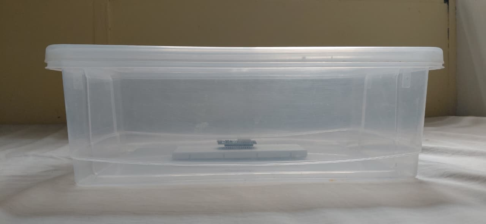
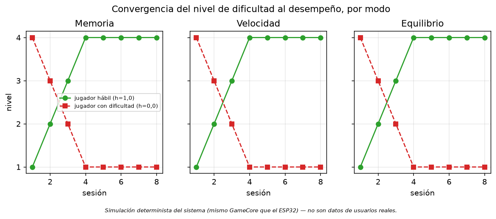
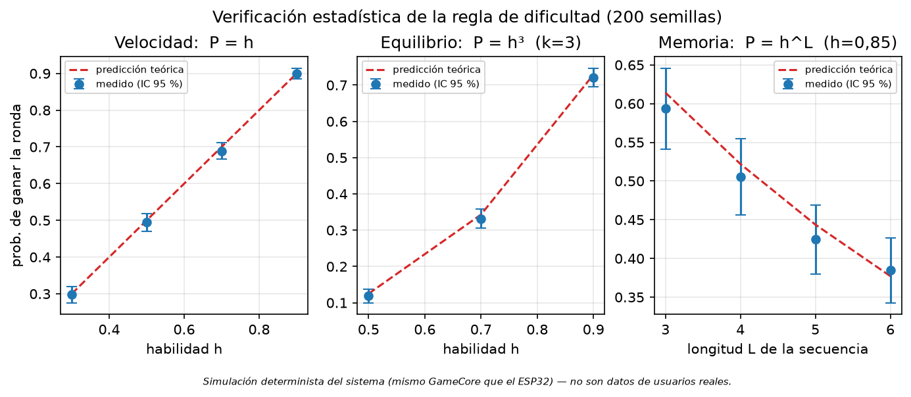

*Programa de Ingeniería Electrónica, Facultad de Ingeniería. Universidad Santiago de Cali, Cali, Colombia.*

*andres.restrepo03@usc.edu.co · christian.galeano01@usc.edu.co*

# Resumen {-}

El síndrome de Down es una condición genética asociada a alteraciones del desarrollo motor y cognitivo, particularmente en el equilibrio, la coordinación, la memoria de trabajo y la planificación motora. Estas dificultades limitan la autonomía y la participación de los niños en entornos educativos y terapéuticos, lo que motiva el desarrollo de estrategias de intervención que complementen las terapias tradicionales. Este artículo presenta el diseño y desarrollo de un tapete interactivo multisensorial de seis casillas que combina secuencias de luces y sonidos como herramienta de apoyo terapéutico. El sistema integra sensores de presión resistivos (FSR), iluminación LED regulada mediante modulación por ancho de pulso (PWM) y salida de audio, gobernados por un microcontrolador ESP32 que ejecuta tres modos de juego orientados a estimular la memoria de trabajo, la velocidad de respuesta y el equilibrio. Un programa de monitoreo en PC registra aciertos, errores y tiempos de reacción, y presenta al terapeuta una recomendación de nivel que este acepta o rechaza: la dificultad se adapta con el profesional en el lazo de decisión, nunca de forma autónoma.

La contribución metodológica central es la estrategia de validación. La lógica de juego se implementó como un núcleo de software portable, sin dependencias del entorno Arduino, que se compila tanto para el microcontrolador como para una biblioteca de enlace dinámico ejecutable en PC. Simulador y prototipo ejecutan, por construcción, el mismo binario lógico. Sobre ese núcleo se ejercitó un jugador simulado, parametrizado por una probabilidad de acierto por pisada, y se obtuvieron nueve evidencias reproducibles: determinismo de la traza, equivalencia de la lógica entre plataformas, respuesta de la adaptación al desempeño en los tres modos, escalado de la exigencia por nivel, convergencia del nivel al desempeño, verificación estadística de la regla de dificultad frente a su predicción analítica, robustez frente a entradas malformadas, costo computacional del núcleo y caracterización analógica del canal de sensado por simulación eléctrica. Destaca la sexta: la probabilidad teórica de ganar una ronda es $h$ en el modo de velocidad, $h^k$ en el de equilibrio y $h^L$ en el de memoria, donde $h$ es la probabilidad de acierto por pisada, $k$ el número de casillas simultáneas y $L$ la longitud de la secuencia; sobre 200 semillas independientes, los once puntos medidos coinciden con la predicción dentro del intervalo de confianza del 95 %.

No se realizaron pruebas con pacientes ni mediciones de impacto clínico, y el trabajo no requirió aprobación de comité de ética. El prototipo físico fue construido y su calibración de sensado se encuentra en curso, por lo que la latencia del lazo físico y la fiabilidad de detección de los sensores no se reportan. El alcance de este trabajo es, por tanto, la viabilidad técnica y la validación funcional del sistema; la evaluación de usabilidad e impacto terapéutico con niños se plantea como trabajo futuro.

**Palabras clave:** síndrome de Down; tapete interactivo; juegos serios; estimulación multisensorial; sensores de presión; ESP32; dificultad adaptativa; validación funcional; software reproducible.

# Abstract {-}

Down syndrome is a genetic condition associated with alterations in motor and cognitive development, particularly affecting balance, coordination, working memory, and motor planning. These difficulties constrain children's autonomy and participation in educational and therapeutic settings, motivating intervention strategies that complement conventional therapy. This article presents the design and development of a six-cell multisensory interactive mat combining light and sound sequences as a therapeutic support tool. The system integrates force-sensing resistors (FSR), pulse-width-modulated LED lighting, and audio output, governed by an ESP32 microcontroller running three game modes aimed at stimulating working memory, response speed, and balance. A PC monitoring application records hits, errors, and reaction times, and presents the therapist with a level recommendation that they accept or reject: difficulty adapts with the professional in the decision loop, never autonomously.

The central methodological contribution is the validation strategy. The game logic was implemented as a portable software core, free of Arduino dependencies, compiled both for the microcontroller and as a shared library executable on a PC. Simulator and prototype therefore execute, by construction, the same logical binary. A simulated player parameterized by a per-step success probability was run against that core, yielding nine reproducible pieces of evidence: trace determinism, cross-platform logic equivalence, response of the adaptation mechanism to performance across all three modes, per-level scaling of demand, convergence of level to performance, statistical verification of the difficulty rule against its analytical prediction, robustness to malformed input, computational cost of the core, and analog characterisation of the sensing channel by circuit simulation. The sixth stands out: the theoretical probability of winning a round is $h$ in speed mode, $h^k$ in balance mode, and $h^L$ in memory mode, where $h$ is the per-step success probability, $k$ the number of simultaneous cells, and $L$ the sequence length; across 200 independent seeds, all eleven measured points agree with the prediction within the 95 % confidence interval.

No tests with patients and no clinical-impact measurements were conducted, and the work required no ethics committee approval. The physical prototype was built and its sensing calibration is ongoing, so physical loop latency and sensor detection reliability are not reported. The scope of this work is thus technical feasibility and functional validation; usability and therapeutic-impact evaluation with children is proposed as future work.

**Keywords:** Down syndrome; interactive mat; serious games; multisensory stimulation; pressure sensors; ESP32; adaptive difficulty; functional validation; reproducible software.

# Introducción

El síndrome de Down, o trisomía 21, se produce por la presencia de una copia adicional del cromosoma 21 y constituye la causa genética más frecuente de discapacidad intelectual [@antonarakis2020down]. Su prevalencia es considerable: en Estados Unidos se estiman alrededor de 12,6 nacimientos con síndrome de Down por cada 10 000 nacimientos vivos [@degraaf2015estimates], y estudios recientes han modelado la población afectada en América Latina y el Caribe, región donde se ubica este trabajo [@degraaf2025latam].

Los niños con esta condición presentan de forma característica hipotonía muscular y alteraciones en el funcionamiento cerebeloso que comprometen el equilibrio y el control postural [@latash2008hypotonia; @galli2008postural]. Como consecuencia, el patrón de marcha resulta inestable y el desarrollo de las habilidades motoras gruesas se retrasa, lo que repercute en la movilidad y en la independencia funcional. En el plano cognitivo, es habitual encontrar dificultades en funciones ejecutivas como la memoria de trabajo, la atención y la planificación, con efectos directos sobre la capacidad de seguir instrucciones, recordar secuencias y comprender información compleja [@lukowski2019cognitive; @grieco2015down]. A ello se suma una velocidad de procesamiento reducida, que dificulta las actividades que exigen rapidez en la toma de decisiones.

Existe evidencia de que la intervención motora temprana e intensiva produce beneficios medibles en esta población [@okada2019assessing], y de que modalidades específicas como la fisioterapia, la hipoterapia o el entrenamiento en cinta rodante mejoran la fuerza, la activación muscular y la marcha [@bevilacqua2023analysis; @kaminska2023benefits]. Sin embargo, muchas de estas terapias, así como los juegos tradicionales empleados como apoyo, carecen de dos propiedades que la tecnología puede aportar con naturalidad: retroalimentación inmediata y personalizada, y registro objetivo del desempeño. Su ausencia dificulta ajustar la dificultad al ritmo del niño, lo que puede derivar en frustración o en desmotivación. Este último punto es especialmente relevante en el síndrome de Down, donde se han documentado estrategias de evitación ante tareas percibidas como difíciles: el niño aprende a rehuir el desafío en lugar de afrontarlo, con un costo acumulado sobre el aprendizaje [@wishart1993learning].

Los juegos serios —aquellos diseñados con una finalidad formativa o terapéutica más allá del entretenimiento— se han consolidado como una herramienta prometedora en este contexto. Una revisión sistemática reciente documenta su uso en intervenciones sobre funciones ejecutivas en niños neurodivergentes [@rodrigueztimana2024use], y trabajos previos han mostrado resultados positivos con interfaces tangibles y entornos multisensoriales [@beccaluva2022vic; @valenciajimenez2023effect]. En paralelo, la literatura sobre ajuste dinámico de la dificultad ha mostrado que adaptar el reto al desempeño mejora la experiencia de uso y sostiene la motivación [@darzi2021dda], e incluso ha llegado a la validación clínica en rehabilitación [@doumas2025dda].

En este contexto, el presente trabajo propone el diseño y desarrollo de un tapete interactivo multisensorial que combina secuencias de luces y sonidos, sensores de presión y un programa de monitoreo en PC, con el fin de estimular las habilidades cognitivas y motoras de los niños con síndrome de Down. El sistema ofrece tres modos de juego orientados a la memoria de trabajo, la velocidad de respuesta y el equilibrio, proporciona retroalimentación inmediata y registra indicadores de desempeño que facilitan el acompañamiento terapéutico.

La pregunta de investigación que guía el trabajo es: **¿cuáles son los elementos clave en el desarrollo de un tapete interactivo con luces y sonidos que favorezcan su efectividad como herramienta de apoyo terapéutico para niños con síndrome de Down?** Para responderla se definió como objetivo general desarrollar un tapete interactivo que combine secuencias de luces y sonidos como herramienta de apoyo en terapias para niños con síndrome de Down, y como objetivos específicos: (i) diseñar el sistema electrónico que integra sensores de presión, módulos de iluminación LED y componentes de salida de audio; (ii) desarrollar el firmware del microcontrolador encargado de la interacción entre sensores, luces y sonidos, implementando diferentes modos terapéuticos adaptables; y (iii) validar el comportamiento funcional del prototipo mediante simulación determinista de su lógica y pruebas de banco.

El artículo realiza tres aportaciones. La primera es de arquitectura: la lógica de juego se aísla en un núcleo portable que se compila sin modificaciones tanto para el microcontrolador como para el PC, de modo que el simulador no es una reimplementación aproximada del dispositivo, sino el dispositivo mismo ejecutándose en otra máquina. La segunda es metodológica: esa propiedad permite validar el comportamiento del sistema de forma reproducible y auditable, sin necesidad de exponer a ningún niño a un prototipo no verificado. La tercera es empírica: se deriva la probabilidad teórica de superar una ronda en cada modo y se contrasta con la medición sobre doscientas semillas independientes, obteniendo una verificación —y no una mera ilustración— de que el mecanismo de dificultad implementa la regla que se le atribuye.

# Marco teórico

## Síndrome de Down y su impacto en el desarrollo infantil

El síndrome de Down es un trastorno genético causado por la presencia total o parcial de una tercera copia del cromosoma 21. Afecta múltiples dominios del desarrollo, tanto físico como cognitivo [@antonarakis2020down]. En el plano físico son comunes la hipotonía muscular, la laxitud ligamentosa y el retraso del desarrollo motor grueso, lo que repercute en el equilibrio y la coordinación. La revisión de Latash y colaboradores sintetiza el conocimiento disponible sobre la relación entre hipotonía, desarrollo de destrezas motoras y actividad física en esta población, y subraya que las dificultades motoras no son un simple déficit de fuerza, sino un problema de control [@latash2008hypotonia]. El estudio instrumentado del control postural confirma esta lectura: los pacientes con síndrome de Down muestran patrones de oscilación y estrategias de estabilización distintos de los de la población típica [@galli2008postural].

En el plano cognitivo, el perfil es heterogéneo pero reconocible. Grieco y colaboradores describen un funcionamiento cognitivo y conductual que varía a lo largo de la vida, con debilidades relativas en el lenguaje expresivo y la memoria verbal a corto plazo, y fortalezas comparativas en el procesamiento visual [@grieco2015down]. Esta asimetría tiene una consecuencia de diseño directa, que este trabajo adopta: una intervención basada en estímulos visuales y espaciales, con instrucciones breves, se apoya en las fortalezas del perfil en lugar de exigir de entrada aquello que resulta más costoso.

## Habilidades motoras: clasificación y evaluación

Las habilidades motoras son secuencias aprendidas de movimientos que se coordinan para ejecutar una acción de forma precisa y eficiente. No son innatas: se adquieren y refinan mediante práctica, retroalimentación y maduración neuromuscular [@vanderfels2015relationship]. Los modelos conceptuales contemporáneos las organizan como un conjunto de destrezas fundamentales del movimiento que se desarrollan a lo largo del ciclo vital y sostienen la actividad física posterior [@hulteen2018foundational]. Suelen distinguirse categorías funcionales: habilidades motoras gruesas (correr, saltar, mantener el equilibrio), finas (manipulación precisa), de coordinación bilateral, de control de objetos y de rendimiento cronometrado.

Esta clasificación importa por dos razones. La primera es que la revisión sistemática de van der Fels y colaboradores documenta una relación consistente entre habilidades motoras y habilidades cognitivas en niños de 4 a 16 años, con asociaciones más fuertes precisamente en las tareas que combinan complejidad motora y demanda cognitiva [@vanderfels2015relationship]. La segunda es que dicha relación no es exclusiva del síndrome de Down: se ha descrito también en otras condiciones del neurodesarrollo, como los trastornos del espectro autista, donde el metaanálisis de Fournier y colaboradores establece un déficit de coordinación motora robusto [@fournier2010motor]. Un dispositivo que exija simultáneamente desplazamiento, equilibrio y decisión —como el tapete que aquí se describe— se sitúa por tanto en la intersección donde la literatura sugiere mayor potencial de transferencia.

## Habilidades cognitivas y funciones ejecutivas

Las funciones ejecutivas son procesos cognitivos de orden superior que permiten el control deliberado del comportamiento. Entre las más relevantes figuran la inhibición de respuesta, la planificación, la atención sostenida y la memoria de trabajo, entendida como la capacidad de retener y manipular información durante períodos breves [@bausela2014funciones]. Su desarrollo es gradual y su compromiso temprano tiene efectos en cascada sobre el aprendizaje.

En niños con síndrome de Down, estas funciones se ven afectadas de manera desigual [@lukowski2019cognitive]. La memoria de trabajo verbal aparece particularmente comprometida, mientras que la memoria visoespacial se conserva mejor. De nuevo, esto orienta el diseño: una tarea de repetición de secuencias definida sobre posiciones espaciales —qué casilla se iluminó, y en qué orden— explota el canal preservado. Los tres modos de juego del presente sistema se corresponden con constructos concretos de esta literatura: memoria de trabajo, velocidad de procesamiento y control postural.

## Juegos serios como herramienta de intervención

Los juegos serios integran dinámicas lúdicas con finalidades formativas o de intervención. A diferencia de los videojuegos convencionales, están diseñados intencionadamente para desarrollar o fortalecer habilidades específicas. Su componente interactivo favorece la participación activa y la repetición voluntaria de tareas que, presentadas como ejercicio, resultarían tediosas.

La revisión sistemática de Rodríguez-Timaná y colaboradores examina específicamente el uso de juegos serios en intervenciones sobre funciones ejecutivas en niños neurodivergentes y documenta resultados favorables, si bien señala la heterogeneidad metodológica del campo y la frecuente ausencia de protocolos de validación técnica de los dispositivos empleados [@rodrigueztimana2024use]. Este último punto es directamente pertinente para el presente trabajo: la validación funcional que aquí se reporta atiende esa carencia antes de cualquier ensayo con usuarios.

## Ajuste dinámico de la dificultad

Un juego terapéutico útil debe permanecer en la franja donde la tarea es alcanzable pero no trivial. El ajuste dinámico de la dificultad (DDA, por sus siglas en inglés) formaliza esa idea: el sistema modifica el reto en función del desempeño observado. Darzi y colaboradores compararon distintos métodos de DDA en un exergame afectivo y encontraron efectos medibles sobre la experiencia de usuario [@darzi2021dda]. Doumas y colaboradores llevaron el enfoque hasta la validación clínica, mostrando que un juego serio auto-adaptativo individualizado es viable en rehabilitación combinada motora y cognitiva tras un ictus [@doumas2025dda].

Ahora bien, la adaptación automática presenta un riesgo en contextos terapéuticos pediátricos: un algoritmo que sube el nivel ante una racha afortunada puede empujar al niño fuera de su zona de competencia justo cuando la evidencia advierte de las estrategias de evitación ante la dificultad [@wishart1993learning]. El sistema aquí descrito adopta por ello una postura intermedia y deliberada, que se detalla en la sección de metodología: el algoritmo **recomienda**, el terapeuta **decide**.

# Estado del arte

La revisión de la literatura evidencia un interés creciente en el uso de tecnologías interactivas y multisensoriales como apoyo a la rehabilitación de niños con discapacidad. A continuación se describen los trabajos más representativos y la brecha que este proyecto aborda.

## VIC: interfaz tangible para entrenar la memoria

Beccaluva y colaboradores desarrollaron VIC, una interfaz de usuario tangible destinada a entrenar habilidades de memoria en niños con discapacidad intelectual [@beccaluva2022vic]. El sistema materializa la tarea de memoria en objetos físicos manipulables, en lugar de confinarla a una pantalla. Los resultados apuntan a que la tangibilidad favorece el compromiso y reduce la carga de la interfaz. VIC comparte con el presente trabajo la apuesta por la interacción física y por la memoria de trabajo como objetivo, pero opera sobre la motricidad fina, mientras que el tapete trabaja sobre motricidad gruesa y control postural.

## Entornos multisensoriales para la propiocepción

Valencia-Jiménez y colaboradores evaluaron el efecto de una intervención basada en un entorno multisensorial para la valoración de la propiocepción en niños con síndrome de Down, empleando sensado óptico para cuantificar el desempeño funcional [@valenciajimenez2023effect]. El estudio, de tipo caso, involucró a tres niños de nueve años de edad promedio a lo largo de doce sesiones de juego terapéutico, y observó una mejora en el perfil psicomotor. Es el antecedente más próximo en cuanto a población y objetivo, y aporta la lección de que el entorno multisensorial debe subordinarse a una tarea con estructura, no limitarse a la estimulación.

## Tapete interactivo para motricidad gruesa

Bernal Díaz y colaboradores presentaron el diseño tecnológico de un tapete interactivo orientado a la motricidad gruesa en niños con discapacidad [@bernal2019tapete]. Es el trabajo más cercano en forma física al aquí descrito. El aporte de la presente propuesta frente a este antecedente se sitúa en dos planos: la incorporación de una lógica de dificultad adaptativa explícita y auditable, y la existencia de un protocolo de validación funcional reproducible del comportamiento del dispositivo.

## PLAYTEK: juguete electrónico para discapacidad mental

Arévalo y colaboradores desarrollaron PLAYTEK, un juguete electrónico dirigido a niños con discapacidad mental, con énfasis en la estimulación mediante estímulos luminosos y sonoros [@arevalo2007playtek]. Aun siendo un trabajo temprano, anticipa el principio de asociación entre acción, estímulo y refuerzo que este proyecto recoge en su diseño de retroalimentación inmediata.

## Juguetes interactivos y realidad virtual en parálisis cerebral

Fuera del síndrome de Down, la literatura sobre parálisis cerebral ofrece evidencia útil sobre eficacia. Bian y colaboradores diseñaron juguetes interactivos para niños con parálisis cerebral atendiendo a los requisitos de accesibilidad física [@bian2020designed], y Chu Minh y colaboradores reportaron resultados preliminares de una solución basada en juegos con juguetes interactivos para rehabilitación del miembro superior [@minh2021gamebased]. En el plano de la síntesis de evidencia, la revisión sistemática con metaanálisis de Chen y colaboradores concluye que la realidad virtual produce efectos positivos en niños con parálisis cerebral [@chen2018effectiveness]. Covaci y colaboradores, por su parte, exploraron la validez de entornos virtuales para personas con discapacidad cognitiva [@covaci2015assessing].

## Síntesis y brecha identificada

Los antecedentes revisados coinciden en tres puntos: la interacción física y multisensorial resulta apropiada para esta población; la retroalimentación inmediata sostiene la motivación; y el registro objetivo del desempeño aporta valor al terapeuta. Coinciden también en una omisión. Ninguno de los trabajos revisados documenta cómo se verificó que el dispositivo se comporta según su especificación **antes** de ponerlo frente a un niño. La validación se reporta, cuando existe, en términos de resultados de la intervención, no de corrección del sistema. Esta brecha es la que el presente trabajo aborda: se propone y ejecuta un protocolo de validación funcional que permite auditar el comportamiento del dispositivo de forma reproducible, y cuyo resultado es condición previa —no sustituta— de cualquier evaluación con usuarios.

# Metodología

El desarrollo se organizó en tres fases, alineadas con los objetivos específicos: diseño del sistema electrónico, desarrollo del firmware con modos terapéuticos adaptables, y validación funcional del comportamiento. Esta sección describe el sistema construido y, con particular detalle, el protocolo de validación, que constituye la aportación metodológica del trabajo.

## Arquitectura general

El sistema consta de tres elementos. Un **tapete físico** de seis casillas dispuestas en dos filas por tres columnas, cada una equipada con un sensor de presión y un grupo de tres diodos emisores de luz. Un **microcontrolador ESP32** que adquiere las pisadas, gobierna la iluminación y el audio, y ejecuta la lógica de los tres modos de juego. Y un **programa de monitoreo en PC** que dialoga con el microcontrolador, registra la sesión y presenta al terapeuta el estado del juego, las métricas de desempeño y la recomendación de nivel.

La frontera entre el dispositivo y el PC es un protocolo de texto documentado, descrito más adelante. Esa frontera es el elemento que hace posible toda la estrategia de validación: cualquier entidad que hable el protocolo puede ocupar el lugar del tapete.

La Figura 1 resume la arquitectura, con los dos dominios de alimentación separados. El esquemático eléctrico completo, con la totalidad de los componentes y sus interconexiones, se incluye en el Anexo A.

{width=92%}

## Diseño del sistema electrónico

Como unidad de procesamiento se seleccionó un módulo de desarrollo ESP32 de 30 pines. Integra conectividad inalámbrica, capacidad de procesamiento local y suficientes interfaces de entrada/salida —convertidores analógico-digitales y salidas moduladas por ancho de pulso— para atender los seis canales de sensado y los seis de iluminación sin circuitería auxiliar de expansión.

**Sensado de pisada.** Cada casilla incorpora un sensor de presión resistivo (FSR 402), cuya resistencia disminuye al aumentar la fuerza aplicada. El sensor forma un divisor de tensión con una resistencia fija de 10 kΩ a masa, de modo que el nodo intermedio, leído por el convertidor analógico-digital, aumenta su tensión con la fuerza. Los seis canales se asignaron a las entradas GPIO 36, 39, 34, 35, 32 y 33, todas pertenecientes al primer bloque de conversión del ESP32, que es el único utilizable cuando la interfaz inalámbrica está activa. El firmware considera pisada toda lectura que supere un umbral configurable, fijado provisionalmente en 2000 sobre un rango de conversión de 0 a 4095. La transferencia de este divisor se caracteriza en la sección de resultados (evidencia E9), lo que permite traducir ese umbral a un valor concreto de resistencia del sensor. La elección del FSR frente a alternativas como celdas de carga o interruptores mecánicos responde a su bajo costo, su perfil delgado y su idoneidad demostrada para plataformas de medición de presión plantar construidas con este mismo componente [@wibowo2020fsr; @jung2024fsr].

**Retroalimentación visual.** Cada casilla dispone de un grupo de tres diodos emisores de luz blanca, alimentados a 5 V y conmutados mediante un arreglo de transistores Darlington ULN2803A, gobernado por seis salidas moduladas por ancho de pulso del microcontrolador (GPIO 4, 5, 18, 19, 21 y 23). Una resistencia de 2,2 kΩ en serie por grupo fija la corriente.

La decisión de emplear **iluminación blanca regulada por PWM en lugar de tiras de LED RGB direccionables** merece justificación explícita, pues se aparta de la propuesta inicial del proyecto. Responde a tres criterios de ingeniería. Primero, accesibilidad: la retroalimentación del tapete se sustenta en la posición de la casilla encendida y en su estado —encendida, apagada, intensidad—, no en la discriminación cromática, con lo que se evita excluir a usuarios con alteraciones de la percepción del color. Segundo, robustez: el control por PWM de un grupo de diodos es más simple y tolerante que el protocolo temporizado que exigen las tiras direccionables, lo que reduce los puntos de fallo en un dispositivo destinado al uso repetido por niños. Tercero, costo y disponibilidad de componentes. Conviene subrayar que esta decisión no compromete la lógica de juego: el firmware expone una abstracción de hardware con las operaciones de encender, apagar y regular intensidad por casilla, de modo que una futura migración a iluminación de color no exigiría modificar la lógica de los modos.

**Salida de audio.** Un módulo DFPlayer Mini, con amplificador integrado y tarjeta microSD, reproduce cuatro pistas asociadas a los eventos del juego: instrucción, acierto, error y éxito de secuencia. Se comunica con el microcontrolador por interfaz serie asíncrona (GPIO 17 y 16) y ataca un parlante de 4 Ω y 3 W.

**Alimentación y montaje.** El conjunto se alimenta exclusivamente desde el puerto USB del PC que ejecuta el programa de monitoreo, decisión que elimina la necesidad de una fuente externa y simplifica la seguridad eléctrica del prototipo en un entorno con niños. El circuito se montó sobre placa de prototipado alojada en una caja transparente de 40 × 28 × 13 cm, con la tapa reforzada mediante láminas de acrílico que distribuyen la carga de la pisada sobre los sensores y sobre la que se dispone el arte gráfico de las seis casillas. Las Figuras 2 y 3 muestran, respectivamente, el inventario de componentes y el prototipo ensamblado.

{width=68%}

{width=52%}

## Arquitectura del software: una sola fuente de verdad

El elemento estructural del que depende toda la validación posterior es la separación estricta entre la lógica de juego y el hardware que la ejecuta.

La lógica reside en un núcleo escrito en C++17 estrictamente portable, sin ninguna dependencia del entorno Arduino: en su interior no aparecen llamadas a lectura de pines, a escritura de PWM ni a temporización del sistema. El núcleo se comunica con el exterior a través de dos abstracciones. La primera, una interfaz de hardware, declara las cuatro operaciones que el mundo físico debe proveer: consultar el tiempo monotónico en milisegundos, leer el valor crudo de un sensor, fijar la intensidad de un grupo de diodos y reproducir un sonido. La segunda, una interfaz de motor, expone a los modos de juego los servicios de alto nivel que necesitan —encender una casilla, emitir un sonido, registrar una puntuación, consultar el nivel vigente y obtener números aleatorios— de modo que ningún modo toca el hardware ni el protocolo directamente.

Este núcleo se compila dos veces. Para el microcontrolador, enlazado con una implementación de la interfaz de hardware que accede a los convertidores, a los canales PWM y al módulo de audio. Para el PC, enlazado con una implementación virtual y empaquetado como biblioteca de enlace dinámico, que el simulador carga en tiempo de ejecución. La consecuencia es central y conviene enunciarla sin ambigüedad: **el simulador no reimplementa el comportamiento del tapete; ejecuta exactamente el mismo código que el tapete**, con el reloj inyectado desde el exterior y las salidas físicas inertes. No existen dos implementaciones que puedan divergir.

El motor es, además, **no bloqueante**. No contiene esperas activas ni suspensiones: recibe el instante actual y avanza su máquina de estados hasta él, resolviendo cuantas transiciones hayan vencido. Los estados son reposo, en ejecución, en pausa y finalizado. Esta propiedad, exigida por la ejecución en un microcontrolador que debe atender simultáneamente sensores, audio y comunicaciones, es la que permite además ejecutar una sesión completa en el PC en microsegundos, con el tiempo simulado a la velocidad que convenga.

**Determinismo.** El núcleo no utiliza el generador de números aleatorios de la biblioteca estándar. Emplea un generador xorshift de 32 bits propio, con semilla fijable desde el protocolo, cuyo estado nulo se normaliza a una constante para evitar el punto fijo degenerado. Toda elección aleatoria del juego —qué casilla se ilumina, qué patrón se propone— deriva de él. En consecuencia, una terna (modo, nivel, semilla) determina por completo la secuencia de eventos que el sistema producirá. Esta propiedad es la base de todo el protocolo de validación.

## Protocolo de comunicación

El microcontrolador y el PC intercambian objetos JSON planos, uno por línea, terminados en salto de línea. El mismo protocolo opera sobre dos transportes intercambiables: puerto serie por USB a 115 200 baudios, empleado como enlace de trabajo, y TCP sobre el puerto 3333 cuando se usa la conectividad inalámbrica.

Para garantizar que la representación sea idéntica en ambos extremos se implementó un serializador propio que acepta un subconjunto estricto de JSON —objetos planos, claves entrecomilladas, valores enteros o cadenas— y emite las claves en un orden canónico fijo por tipo de mensaje. Esta decisión, aparentemente menor, es la que permite comparar trazas byte a byte entre el firmware y el simulador.

El dispositivo emite siete tipos de evento: `hello` (saludo, con versión de firmware y número de casillas), `led` (estado de iluminación de una casilla), `press` (pisada detectada, con marca temporal relativa al inicio de sesión), `sound` (reproducción de una pista), `score` (aciertos, errores, tiempo de reacción y ronda), `state` (estado del motor) y `suggest` (recomendación de nivel). El PC emite ocho comandos: `set_mode`, `start`, `stop`, `pause`, `set_level`, `set_player`, `set_seed` y `ping`.

## Modos de juego y parámetros

El sistema integra tres modos, cada uno con cuatro niveles de dificultad. La Tabla 1 los resume; la Tabla 2 detalla los parámetros exactos por nivel, tal como están definidos en la configuración del firmware.

: Modos de juego del tapete interactivo.

| Modo | Habilidad estimulada | Dinámica de interacción |
|:--|:--|:-------|
| Memoria de secuencias | Memoria de trabajo y planificación motora | El tapete exhibe una secuencia de casillas iluminadas que el niño observa y repite pisando en el mismo orden. Si acierta la secuencia completa, esta crece en un elemento; si falla, se reexhibe la misma. |
| Velocidad de respuesta | Velocidad de procesamiento y reacción | Una casilla se ilumina aleatoriamente y el niño debe pisarla antes de que expire la ventana de tiempo. Se registra el tiempo de reacción. |
| Equilibrio y coordinación | Coordinación bilateral y control postural | Se iluminan simultáneamente varias casillas que el niño debe pisar todas dentro del tiempo límite, lo que le obliga a repartir el apoyo y controlar la postura. |

: Parámetros de dificultad por nivel, definidos en la configuración del firmware.

| Modo | Parámetro | Nivel 1 | Nivel 2 | Nivel 3 | Nivel 4 |
|:--|:--|--:|--:|--:|--:|
| Memoria | Longitud inicial de la secuencia | 2 | 3 | 4 | 5 |
| Memoria | Longitud final (fin de sesión) | 5 | 6 | 7 | 8 |
| Memoria | Tiempo de exhibición por casilla (ms) | 600 | 500 | 400 | 300 |
| Velocidad | Ventana de reacción (ms) | 3000 | 2000 | 1200 | 1000 |
| Velocidad | Rondas por sesión | 5 | 8 | 10 | 12 |
| Equilibrio | Casillas simultáneas del patrón | 2 | 3 | 4 | 4 |
| Equilibrio | Tiempo límite del patrón (ms) | 5000 | 4000 | 3000 | 2500 |
| Equilibrio | Rondas por sesión | 4 | 6 | 8 | 10 |

El intervalo entre casillas de la exhibición en el modo de memoria es de 250 ms, constante. Los tres modos releen el nivel vigente al comienzo de cada ronda, de manera que un cambio ordenado por el terapeuta a mitad de sesión surte efecto en la ronda siguiente sin reiniciar el juego.

## Dificultad adaptativa con el terapeuta en el lazo

El sistema mantiene una ventana móvil con el resultado —acierto o fallo— de las cuatro últimas rondas y calcula sobre ella la tasa de acierto. Cuando la ventana está incompleta no se pronuncia. Una vez llena, aplica la regla siguiente: si la tasa alcanza o supera el 75 %, recomienda **subir** un nivel; si es igual o inferior al 25 %, recomienda **bajar** uno; en la banda intermedia recomienda **mantener**. El nivel propuesto se acota al intervalo de 1 a 4, y si tras acotarlo coincide con el vigente, la recomendación se degrada a mantener. La recomendación se transmite al PC únicamente cuando cambia de dirección respecto a la anterior, lo que evita saturar la interfaz.

La decisión de diseño que conviene destacar es que **el sistema nunca cambia el nivel por sí mismo**. La recomendación viaja al programa de monitoreo, se muestra al terapeuta, y solo se aplica si este emite la orden correspondiente. La literatura sobre ajuste dinámico de la dificultad respalda la utilidad de adaptar el reto [@darzi2021dda; @doumas2025dda], pero la evidencia sobre estrategias de evitación en niños con síndrome de Down aconseja prudencia ante los cambios automáticos [@wishart1993learning]: un profesional que observa al niño dispone de información —fatiga, frustración, distracción— que ninguna tasa de acierto captura. El algoritmo aporta objetividad; el terapeuta, criterio.

## Sistema de monitoreo en PC

El programa de monitoreo, desarrollado en Python con interfaz gráfica Qt, se conecta al dispositivo por puerto serie o por red y consume el mismo protocolo. Presenta el estado del tapete en tiempo real, permite seleccionar modo y nivel, iniciar, pausar y detener la sesión, y muestra las métricas acumuladas junto con la recomendación vigente.

La persistencia se resuelve sobre una base de datos SQLite con tres tablas: perfiles de usuario, sesiones —con modo, nivel, marcas temporales, aciertos, errores, tiempo de reacción promedio, rondas y estado final— y eventos, donde se archivan las pisadas y las puntuaciones con su marca temporal. A partir de ese registro, la aplicación exporta un informe por sesión en formato CSV, con el resumen y el registro completo de eventos, y en formato PDF, con los indicadores y una gráfica de aciertos frente a errores.

El programa incorpora además un modo de práctica que ejecuta el núcleo embebido en el propio PC, sin hardware. Al ser el mismo núcleo, el terapeuta puede familiarizarse con la interfaz y con la dinámica de los tres modos de forma idéntica a como se comportará el dispositivo físico.

## Protocolo de validación

La validación se estructuró en dos niveles complementarios. **Ninguno involucró la participación de pacientes.**

**Nivel 1: validación de la lógica por simulación determinista.** Sobre la biblioteca compilada para PC se ejecuta un *jugador simulado* parametrizado por una **habilidad** $h \in [0,1]$, definida como la probabilidad de ejecutar correctamente cada pisada individual. El jugador reacciona a los eventos de iluminación que emite el núcleo —memorizando la secuencia en el modo de memoria, atendiendo a la casilla activa en el de velocidad, pisando las casillas del patrón en el de equilibrio— y su dado es, a su vez, un generador xorshift sembrado de forma determinista. En consecuencia, la cuádrupla (modo, nivel, semilla, habilidad) determina íntegramente la sesión, y cualquier cifra reportada puede regenerarse exactamente.

**Nivel 2: validación funcional de banco.** Comprende dos clases de evidencia. Por un lado, la que se obtiene sobre la implementación sin necesidad del prototipo: el costo computacional del núcleo compilado, la huella de recursos en el microcontrolador y la caracterización del circuito analógico de sensado mediante simulación eléctrica. Por otro, la que exige el prototipo físico instrumentado: la latencia del lazo pisada→retroalimentación y la fiabilidad de detección de los sensores, incluida la calibración de su umbral de activación, capturadas a través del programa de monitoreo.

**Herramientas de verificación.** La lógica se verifica con dos suites de pruebas unitarias —una en C++ sobre el núcleo, otra en Python sobre el simulador y el programa de monitoreo— y con un conjunto de escenarios de referencia que fijan la traza esperada de eventos. El esquemático eléctrico se somete a la comprobación de reglas eléctricas (ERC) de la herramienta de diseño, que verifica que no queden pines sin conectar ni conflictos de alimentación. El circuito analógico se simula con ngspice a partir del netlist del propio diseño. El firmware compilado, por último, se ejecuta en un simulador de microcontrolador (Wokwi) dentro de la integración continua, donde se comprueba que arranca y emite correctamente el saludo del protocolo por el puerto serie; conviene precisar que ese simulador reproduce el microcontrolador, no los periféricos analógicos, de modo que su alcance es la verificación del firmware, no del circuito.

Las evidencias se numeran de E1 a E11. Las siete primeras se obtienen por simulación determinista de la lógica; la octava y la novena, por medición sobre la implementación compilada y por simulación eléctrica del circuito —banco de software, sin el prototipo físico—. Las nueve se reportan en la sección de resultados. Las dos últimas dependen del prototipo instrumentado y se declaran pendientes.

: Evidencias del protocolo de validación y su estado.

| Id | Evidencia | Nivel | Estado |
|:--|:-----|:--|:--|
| E1 | Determinismo de la traza de ejecución | Simulación | Reportada |
| E2 | Equivalencia de la lógica entre firmware y simulador | Simulación | Reportada |
| E3 | Respuesta de la adaptación al desempeño, por modo | Simulación | Reportada |
| E4 | Escalado de la exigencia con el nivel, por modo | Simulación | Reportada |
| E5 | Convergencia del nivel al desempeño, por modo | Simulación | Reportada |
| E6 | Verificación estadística de la regla de dificultad | Simulación | Reportada |
| E7 | Robustez frente a entradas malformadas | Simulación | Reportada |
| E8 | Costo computacional del núcleo y huella de recursos | Banco de software | Reportada |
| E9 | Caracterización analógica del canal de sensado (SPICE) | Banco de software | Reportada |
| E10 | Latencia del lazo físico pisada→retroalimentación | Banco (prototipo) | **Pendiente** |
| E11 | Fiabilidad de detección de los sensores y umbral | Banco (prototipo) | **Pendiente** |

La evaluación del impacto terapéutico con pacientes, que requeriría un protocolo clínico con aprobación de comité de ética, consentimiento informado y seguimiento longitudinal, **no se aborda en este trabajo** y se plantea como trabajo futuro.

# Resultados

Todas las cifras de esta sección se generan de forma reproducible mediante un único guion de experimentos que ejecuta el núcleo de software y vuelca sus resultados; ninguna se transcribió a mano. Salvo indicación contraria, la semilla es 777.

> **Advertencia sobre el alcance.** Las figuras y tablas que siguen describen el comportamiento del **sistema**, obtenido por simulación determinista de su lógica y por medición sobre su implementación. **No son datos obtenidos con pacientes** y no autorizan ninguna afirmación sobre eficacia terapéutica.

## Determinismo de la traza (E1)

Dos ejecuciones independientes de una misma configuración —modo, nivel 2, semilla 777, habilidad 0,8— produjeron trazas de puntuación idénticas en los tres modos, verificadas mediante resumen criptográfico SHA-256 de la secuencia completa de eventos. Los resúmenes obtenidos comienzan por `b63d8131…` (memoria), `862fe628…` (velocidad) y `00c531fa…` (equilibrio), y coincidieron entre ejecuciones en los tres casos.

Este resultado, aparentemente modesto, es la condición de posibilidad de todos los demás: si el sistema no fuese reproducible, ninguna cifra de las siguientes secciones podría verificarse de forma independiente. El determinismo convierte cada figura de este artículo en un experimento repetible por cualquier lector que disponga del código y de la semilla.

## Equivalencia de la lógica entre plataformas (E2)

La estrategia de fuente única de verdad se somete a comprobación mediante un conjunto de ocho escenarios de referencia —*golden vectors*—, que fijan, para una configuración y una semilla dadas, la secuencia exacta de eventos que el sistema debe emitir. Los escenarios cubren los tres modos e incluyen casos de acierto, expiración de la ventana, cambio de nivel en plena sesión y emisión de recomendaciones en ambas direcciones.

Dos de los ocho escenarios se verifican en modo **estricto**: la traza emitida debe coincidir con la esperada elemento a elemento, sin eventos intermedios ni omisiones. Los seis restantes exigen que la traza esperada aparezca como subsecuencia ordenada de la emitida. Los ocho escenarios se ejecutan contra la biblioteca compilada desde el mismo código fuente que se carga en el microcontrolador, y los ocho pasan. Dado que no existen dos implementaciones de la lógica, este resultado no debe leerse como una comparación entre dos sistemas que coinciden, sino como la verificación de que el único sistema existente se comporta según su especificación en ambos destinos de compilación.

## Respuesta de la adaptación al desempeño (E3)

Se ejecutó un barrido de la habilidad del jugador simulado de 0 % a 100 %, en incrementos de 10 puntos, sobre el nivel 2 de cada modo. La tasa de acierto de la sesión crece de forma monótona con la habilidad en los tres modos, y la dirección recomendada por el sistema sigue coherentemente al desempeño: recomienda **bajar** el nivel ante habilidades bajas y **subir** ante habilidades altas.

La Figura 4 presenta el caso del modo de velocidad, para el que la recomendación transita por las tres direcciones posibles: sugiere bajar con habilidades de 0 a 10 %, mantener entre 20 y 30 % —franja en la que la tasa de acierto se sitúa en el 50 %, dentro de la banda muerta del recomendador— y subir a partir del 40 %.

Conviene evitar aquí una lectura errónea de la figura. El eje vertical representa la tasa de acierto de la **sesión completa**, mientras que la dirección recomendada se calcula sobre la **ventana de las cuatro últimas rondas**. Ambas magnitudes no tienen por qué coincidir: con una habilidad del 40 %, la sesión cierra con un 62,5 % de aciertos y, sin embargo, el sistema recomienda subir, porque las cuatro rondas finales alcanzaron el umbral del 75 %. La figura describe el desempeño global; la recomendación responde al desempeño reciente, que es justamente lo que interesa a un mecanismo adaptativo.

El comportamiento difiere entre modos de una manera que la propia estructura del juego explica. En el modo de velocidad, cada ronda exige una única pisada correcta, de modo que la tasa de acierto sigue de cerca a la habilidad. En el de equilibrio, la ronda solo se gana si se pisan correctamente las $k$ casillas del patrón; y en el de memoria, si se reproducen los $L$ pasos de la secuencia. La exigencia efectiva es, por tanto, considerablemente mayor en estos dos modos: con una habilidad del 70 %, el jugador simulado alcanza el 75 % de aciertos en velocidad, el 67 % en equilibrio y solo el 40 % en memoria. Esta observación, lejos de ser un defecto, describe con precisión el papel de cada modo: el de memoria es el más exigente porque acumula la demanda a lo largo de una secuencia. La sección E6 convierte esta observación cualitativa en una predicción cuantitativa y la somete a contraste.

## Escalado de la exigencia con el nivel (E4)

Se evaluaron los cuatro niveles de cada modo con una habilidad fija del 80 %. Los resultados aparecen en la Tabla 4.

: Indicadores por nivel en simulación determinista, habilidad fija del 80 %. En el modo de memoria, la última columna indica la longitud final de la secuencia; en los otros dos, el número de rondas de la sesión.

| Modo | Nivel | Aciertos | Errores | Rondas / longitud final |
|:--|--:|--:|--:|--:|
| Memoria | 1 | 4 | 1 | 5 |
| Memoria | 2 | 4 | 4 | 6 |
| Memoria | 3 | 4 | 4 | 7 |
| Memoria | 4 | 4 | 9 | 8 |
| Velocidad | 1 | 4 | 1 | 5 |
| Velocidad | 2 | 7 | 1 | 8 |
| Velocidad | 3 | 9 | 1 | 10 |
| Velocidad | 4 | 11 | 1 | 12 |
| Equilibrio | 1 | 3 | 1 | 4 |
| Equilibrio | 2 | 5 | 1 | 6 |
| Equilibrio | 3 | 4 | 4 | 8 |
| Equilibrio | 4 | 6 | 4 | 10 |

En el modo de velocidad, el nivel controla la longitud de la sesión (de 5 a 12 rondas) manteniendo estable el desempeño del jugador simulado: un único error por sesión en los cuatro niveles, acorde con la habilidad fijada. La sesión se alarga y la ventana de reacción se estrecha, pero la mecánica no cambia.

En el modo de memoria el patrón es distinto y revelador. El número de aciertos por sesión es constante e igual a cuatro en los cuatro niveles, porque por construcción la sesión termina cuando la secuencia alcanza su longitud final, tres elementos por encima de la inicial. Lo que crece con el nivel no es el número de aciertos sino el de errores necesarios para llegar hasta allí: de uno en el nivel 1 a nueve en el nivel 4. La dificultad se manifiesta como costo de intentos, no como duración.

El modo de equilibrio muestra el salto esperado entre los niveles 2 y 3, donde el patrón pasa de tres a cuatro casillas simultáneas: los errores se cuadruplican, de uno a cuatro. Es el punto en el que la demanda de control postural se vuelve dominante.

## Convergencia del nivel al desempeño (E5)

Encadenando sesiones y aplicando en cada una la recomendación emitida por el sistema, se simularon dos perfiles extremos: un jugador con habilidad máxima que comienza en el nivel 1, y un jugador con habilidad nula que comienza en el nivel 4. La Figura 5 muestra el resultado para los tres modos.

En los tres modos, el jugador hábil escala 1→2→3→4 en tres sesiones y se estabiliza en el máximo, mientras que el jugador con dificultad desciende 4→3→2→1 y se estabiliza en el mínimo. La saturación en los extremos es la conducta correcta: el recomendador degrada su propuesta a «mantener» cuando el nivel acotado coincide con el vigente, de modo que no propone cambios imposibles.

Conviene recordar la salvedad de diseño: esta trayectoria se obtiene **aplicando** cada recomendación, cosa que en operación real hace el terapeuta, no el sistema. La figura describe, pues, el comportamiento del recomendador si sus sugerencias se aceptasen siempre, que es el escenario límite útil para caracterizarlo.

## Verificación estadística de la regla de dificultad (E6)

Las evidencias anteriores muestran que el mecanismo de adaptación se comporta *como cabría esperar*. Esta sección da un paso más y verifica que implementa exactamente la regla que se le atribuye.

Considérese un jugador que acierta cada pisada individual con probabilidad $h$, de forma independiente. Una ronda del modo de velocidad se gana con una única pisada correcta, de modo que la probabilidad de ganarla es $P = h$. Una ronda del modo de equilibrio exige acertar las $k$ casillas del patrón, y un solo fallo la pierde: $P = h^k$. Una ronda del modo de memoria exige reproducir los $L$ pasos de la secuencia: $P = h^L$. Estas tres expresiones son predicciones cerradas, derivadas de la especificación del juego y no de su implementación.

Para contrastarlas se ejecutaron 200 semillas independientes por punto y se agregaron todas las rondas observadas. La Tabla 5 y la Figura 6 comparan la proporción medida con la predicción teórica. El intervalo de confianza del 95 % se calculó por aproximación normal sobre la proporción.

: Verificación estadística de la regla de dificultad. Proporción de rondas ganadas, medida sobre 200 semillas, frente a la predicción analítica.

| Modo | Parámetro | Rondas | Medido | IC 95 % | Teoría | ¿Coincide? |
|:--|:--|--:|--:|--:|--:|:--|
| Velocidad | $h = 0{,}3$ | 1600 | 0,298 | ± 0,022 | 0,300 | Sí |
| Velocidad | $h = 0{,}5$ | 1600 | 0,494 | ± 0,024 | 0,500 | Sí |
| Velocidad | $h = 0{,}7$ | 1600 | 0,689 | ± 0,023 | 0,700 | Sí |
| Velocidad | $h = 0{,}9$ | 1600 | 0,900 | ± 0,015 | 0,900 | Sí |
| Equilibrio | $h = 0{,}5$, $k = 3$ | 1200 | 0,118 | ± 0,018 | 0,125 | Sí |
| Equilibrio | $h = 0{,}7$, $k = 3$ | 1200 | 0,332 | ± 0,027 | 0,343 | Sí |
| Equilibrio | $h = 0{,}9$, $k = 3$ | 1200 | 0,722 | ± 0,025 | 0,729 | Sí |
| Memoria | $h = 0{,}85$, $L = 3$ | 337 | 0,593 | ± 0,052 | 0,614 | Sí |
| Memoria | $h = 0{,}85$, $L = 4$ | 396 | 0,505 | ± 0,049 | 0,522 | Sí |
| Memoria | $h = 0{,}85$, $L = 5$ | 471 | 0,425 | ± 0,045 | 0,444 | Sí |
| Memoria | $h = 0{,}85$, $L = 6$ | 520 | 0,385 | ± 0,042 | 0,377 | Sí |

Los **once puntos** medidos contienen la predicción teórica dentro de su intervalo de confianza del 95 %. En el modo de memoria, además, la medición se estratificó por longitud de secuencia, lo que permite comprobar la ley $h^L$ en un rango de longitudes de 3 a 6 dentro de una misma sesión.

El significado de este resultado merece precisarse. No demuestra que el sistema sea terapéuticamente eficaz, ni que la dificultad esté bien calibrada para un niño real. Demuestra algo más modesto y, para un dispositivo destinado a uso clínico, más fundamental: que el comportamiento observable del motor coincide con el modelo formal de su regla de dificultad. Es la diferencia entre afirmar que un mecanismo *parece* funcionar y verificar que hace lo que su especificación dice.

## Robustez frente a entradas malformadas (E7)

Un dispositivo que dialoga por un enlace serie con un PC recibirá, tarde o temprano, líneas truncadas, ruido eléctrico o mensajes mal formados. En un microcontrolador compilado sin soporte de excepciones, un desbordamiento numérico en el analizador sintáctico no produce un error recuperable: aborta el firmware.

El sistema se sometió por ello a un conjunto de pruebas de entradas aleatorias. El analizador del protocolo en C++ —el mismo que se ejecuta en el microcontrolador— procesó **40 000 líneas** generadas de forma pseudoaleatoria y determinista (20 000 contra el analizador de comandos y 20 000 contra el de eventos), más 18 fragmentos construidos a mano con valores extremos, entre ellos enteros de treinta dígitos y valores en los límites del rango representable. El analizador del lado del PC procesó **18 000 líneas** basura reproducibles, y la interfaz gráfica se sometió a un generador de eventos aleatorios que ejecutó **15 000 acciones** de usuario —iniciar, detener, pausar, cambiar de modo y de nivel, pisar casillas, cambiar de pestaña— repartidas en tres semillas.

Ninguna de estas pruebas produjo una excepción no controlada ni una terminación anómala. Los hallazgos que motivaron este esfuerzo fueron reales y se corrigieron: el analizador original empleaba conversiones de la biblioteca estándar que lanzaban excepción ante enteros fuera de rango, y la aplicación de escritorio podía morir por un error interno en un manejador de eventos. La suite de pruebas del proyecto comprende hoy 52 casos con 2174 aserciones en C++ y 135 pruebas en Python.

## Costo computacional y huella de recursos (E8)

Se midió el costo de cómputo del núcleo compilado con optimización sobre un procesador Intel Core i7-1355U, ejercitando directamente la máquina de estados y serializando cada evento emitido como haría el firmware. A diferencia del resto de las evidencias, esta medición **no es determinista**: depende del procesador y de la carga de la máquina. Se reporta, por tanto, como mediana de siete ejecuciones, con su rango observado.

Por ser medidas de tiempo de ejecución, estas cifras dependen del procesador y de la carga de la máquina, y varían entre ejecuciones; se informan, por tanto, como órdenes de magnitud y no como valores exactos, y los datos puntuales de la última corrida quedan registrados en `resultados.json`. Un ciclo de avance temporal sin transiciones cuesta **unos pocos nanosegundos** (mediana en torno a 5 ns). Una pisada que sí produce eventos —encendido o apagado de casilla, sonido, puntuación y, cuando corresponde, recomendación— cuesta **alrededor de medio microsegundo** (mediana en el entorno de 450–500 ns), promediada sobre 240 000 pisadas efectivas por ejecución. Una sesión completa del modo de velocidad en nivel 4, con sus doce rondas, se resuelve en **unos pocos microsegundos** (mediana cercana a 6 µs).

Estas cifras deben leerse con cuidado. Corresponden a un procesador de PC, no al microcontrolador, y **no constituyen la latencia del lazo de interacción física**, que incluye el tiempo de conversión analógico-digital, el filtrado de la pisada y la conmutación de los diodos, y que solo puede medirse sobre el prototipo instrumentado (evidencia E10, pendiente). Lo que sí establecen es que el costo de la lógica es más de seis órdenes de magnitud inferior a la escala temporal del juego —cuya ventana de reacción más exigente es de 1000 ms, frente al medio microsegundo que cuesta procesar una pisada— y que, por tanto, el núcleo no puede constituir el cuello de botella del lazo de interacción.

Respecto a la huella en el dispositivo, la compilación del firmware para el ESP32 ocupa **60,2 %** de la memoria de programa (788 501 de 1 310 720 bytes) y **13,8 %** de la memoria de datos (45 324 de 327 680 bytes), lo que deja margen suficiente para las extensiones previstas.

## Caracterización analógica del canal de sensado (E9)

El esquemático del sistema se sometió a la comprobación de reglas eléctricas de la herramienta de diseño, que no reportó infracciones. A partir de ese diseño se simuló con ngspice el canal de sensado: un divisor formado por el sensor de presión y la resistencia fija de 10 kΩ a masa, alimentado a 3,3 V.

El divisor admite solución cerrada, $V_{nodo} = V_{ref}\,R_M/(R_{FSR}+R_M)$, lo que permite la misma clase de contraste aplicada a la lógica en la sección anterior: la simulación debe reproducir la expresión analítica. Sobre once valores de resistencia entre 250 Ω y 10 MΩ, la discrepancia máxima entre ngspice y la fórmula fue de $2{,}9\times10^{-6}$ V, es decir, del orden del error de redondeo. La Figura 7 muestra la curva.

{width=88%}

El resultado de interés práctico es la traducción del umbral. El firmware considera pisada toda lectura superior a 2000 cuentas de las 4095 del convertidor, lo que equivale a **1,61 V** en el nodo. Según la curva, esa tensión se alcanza cuando la resistencia del sensor desciende hasta **10,5 kΩ**, valor muy próximo a la resistencia de la carga fija, como corresponde a un divisor equilibrado. Dicho de otro modo, el umbral vigente exige que la pisada haga descender la resistencia del sensor hasta el orden de la resistencia de carga. Cuánto vale esa resistencia sin fuerza aplicada —y qué fuerza se necesita para llevarla a 10,5 kΩ— es un dato que este trabajo **no ha medido**: el barrido de la Figura 7 se extiende hasta 10 MΩ como rango de exploración, no como valor característico del sensor. Fijar el umbral definitivo exige, por tanto, caracterizar el sensor sobre el prototipo instrumentado (evidencia E11, pendiente). Lo que la simulación aporta es la traducción exacta entre umbral digital y resistencia, que convierte esa caracterización en una única medida de contraste en lugar de una búsqueda a ciegas.

Esta caracterización acota el espacio de calibración pendiente (E11) sin necesidad del prototipo: fija el objetivo que la instrumentación física debe verificar. No lo sustituye, porque la relación entre la fuerza aplicada y la resistencia del sensor depende del área de contacto y de la distribución de la carga bajo la tapa, y esa relación solo puede establecerse midiendo.

Sobre la etapa de actuación, la misma simulación estima una corriente de 577 µA por grupo de tres diodos, unos 192 µA por diodo, con la resistencia de 2,2 kΩ del inventario. Esta cifra debe leerse con más cautela que la anterior: a diferencia del divisor, que es puramente resistivo, el modelo del diodo y la tensión de saturación del transistor Darlington son valores asumidos, no medidos. Se reporta como estimación de orden de magnitud —coherente con el brillo tenue observado y buscado— pendiente de confirmación con multímetro sobre el circuito armado.

## Prototipo físico

El prototipo fue construido conforme al diseño descrito: se montó el circuito completo, se integraron los seis sensores y los seis grupos de iluminación en la tapa reforzada, y se verificó con multímetro la ausencia de cortocircuitos entre los rieles de alimentación antes de energizar. El enlace serie con el programa de monitoreo funciona: el dispositivo anuncia su versión de firmware, acepta comandos y emite eventos de estado y puntuación, que quedan registrados en la base de datos de sesiones.

La calibración del umbral de detección de los sensores se encuentra **en curso** en el momento de redactar este artículo. En consecuencia, las evidencias E10 —latencia del lazo físico— y E11 —fiabilidad de detección y umbral de activación— no se reportan aquí. El instrumental de captura necesario para obtenerlas forma parte del sistema y está operativo: el programa de monitoreo registra cada pisada con su marca temporal, y se dispone de un modo de firmware específico que expone por el enlace serie los valores crudos de conversión de los seis canales, así como de una herramienta que emite un veredicto por casilla a partir de los eventos almacenados. Su ejecución queda supeditada a la finalización de la calibración.

## Trazabilidad objetivo–evidencia

: Trazabilidad de los objetivos específicos a las evidencias que los respaldan.

| Objetivo específico | Evidencia asociada | Estado de validación |
|:------|:-----|:-----|
| (i) Diseñar el sistema electrónico (FSR, iluminación LED, audio) | Esquema de conexiones, lista de materiales y prototipo construido; E8 (huella de recursos); E11 (detección); E9 (caracterización analógica) | Diseño completo y prototipo ensamblado; verificación de sensado en curso (E11 pendiente) |
| (ii) Desarrollar el firmware con tres modos terapéuticos adaptables | Núcleo portable único; E1, E2 (determinismo y equivalencia); E3–E6 (adaptación en los tres modos); E7 (robustez) | Completo y verificado en los tres modos, incluida la regla de dificultad |
| (iii) Validar el comportamiento funcional del prototipo | E1–E7 por simulación determinista; E8 y E9 en banco de software; E10–E11 sobre el prototipo | Validación por software completa; validación de banco físico pendiente |

# Discusión

Los resultados obtenidos permiten pronunciarse sobre la viabilidad técnica y funcional del tapete interactivo, y responder a la pregunta de investigación que guio el trabajo.

El determinismo de la lógica (E1) garantiza que el comportamiento del sistema es reproducible y auditable, condición necesaria para que cualquier evidencia funcional sea verificable por un tercero. Sobre esa base, la equivalencia entre plataformas (E2) elimina una fuente habitual de error en los sistemas embebidos con simulador: la divergencia entre el modelo y el dispositivo. Aquí no puede haber divergencia porque no hay dos artefactos, sino uno solo compilado para dos destinos. Esta decisión de arquitectura, tomada al inicio del proyecto, es la que hace que todo lo demás sea afirmable.

Las evidencias E3, E4 y E5 muestran que la lógica de dificultad cumple su función de diseño en los tres modos: la recomendación sigue al desempeño en la dirección esperada, el nivel controla la exigencia de manera predecible y el nivel converge hacia el desempeño del usuario a lo largo de sesiones sucesivas. La evidencia E6 va más allá y verifica que la regla implementada coincide con su formulación analítica, lo que permite razonar sobre el sistema —por ejemplo, para calibrar los umbrales del recomendador ante una población concreta— con un modelo cerrado y no con una caja negra.

Un hallazgo no anticipado merece comentario. La estructura de cada modo determina cómo la habilidad del usuario se traduce en tasa de éxito, y lo hace de forma muy desigual: linealmente en el modo de velocidad, exponencialmente con el número de casillas en el de equilibrio y con la longitud de la secuencia en el de memoria. Un mismo umbral de recomendación —el 75 % de aciertos para subir de nivel— significa, por tanto, exigencias muy distintas según el modo. Un niño con una habilidad por pisada del 90 % supera el umbral en velocidad, lo roza en equilibrio con patrones de tres casillas y queda claramente por debajo en memoria con secuencias de seis pasos. La consecuencia práctica es que los umbrales del recomendador deberían, en un desarrollo futuro, especificarse por modo y no de forma global. Esta observación, que ningún ensayo cualitativo habría hecho evidente, emerge directamente de haber contrastado el comportamiento medido con su modelo formal.

La capacidad de adaptar la dificultad al desempeño, ausente en muchas terapias y juegos tradicionales, se confirma como uno de los elementos clave de la propuesta, en línea con lo reportado por la literatura sobre juegos serios [@rodrigueztimana2024use] y sobre ajuste dinámico de la dificultad [@darzi2021dda; @doumas2025dda]. La decisión de mantener al terapeuta en el lazo de decisión, en lugar de automatizar el cambio de nivel, sitúa a este sistema en una posición deliberadamente conservadora respecto de esa literatura, y encuentra respaldo en la evidencia sobre estrategias de evitación ante la dificultad en niños con síndrome de Down [@wishart1993learning].

Frente a los antecedentes revisados, el prototipo se ubica en la misma línea que las soluciones tangibles y multisensoriales que han mostrado potencial en esta población [@beccaluva2022vic; @valenciajimenez2023effect; @bernal2019tapete], y aporta sobre ellas un protocolo de validación funcional reproducible que, hasta donde alcanza esta revisión, no aparece documentado en trabajos comparables.

Respondiendo, pues, a la pregunta de investigación: los elementos clave identificados son la integración multisensorial coherente, con luces y sonidos sincronizados con la acción; la retroalimentación inmediata; la adaptabilidad de la dificultad al desempeño, mediada por criterio profesional; y el registro objetivo del desempeño que permite al terapeuta acompañar el proceso con datos. A ellos debe añadirse un quinto elemento, de naturaleza metodológica, que este trabajo defiende: la verificabilidad del propio dispositivo como requisito previo a su uso.

# Limitaciones

Este trabajo presenta limitaciones que conviene enunciar sin atenuantes.

**No hubo participación de usuarios.** La validación se realizó íntegramente sobre la lógica del sistema mediante simulación determinista y sobre su implementación mediante pruebas de software. No se realizaron pruebas con niños con síndrome de Down, ni con niños de desarrollo típico, ni con terapeutas. En consecuencia, este trabajo **no permite afirmar nada** sobre la experiencia de uso real, la aceptación del dispositivo, su usabilidad, la motivación que genera ni su impacto cognitivo o motor. Ninguna cifra de la sección de resultados debe interpretarse como un indicio de eficacia terapéutica.

**El jugador simulado no es un niño.** El modelo de usuario empleado reduce el comportamiento a un único parámetro: la probabilidad de acertar cada pisada, constante e independiente entre pisadas. Un niño real presenta fatiga, aprendizaje intrasesión, variabilidad en el tiempo de reacción, distracción y correlación entre errores consecutivos. El jugador simulado es un instrumento para verificar el sistema, no un modelo del usuario. Las trayectorias de convergencia de la Figura 5 caracterizan al recomendador, no predicen la progresión de ningún niño.

**La validación de banco física está incompleta.** Las evidencias E10 y E11 —latencia del lazo pisada→retroalimentación y fiabilidad de detección de los sensores— no se reportan porque la calibración del umbral de sensado se encuentra en curso. Hasta disponer de ellas, la afirmación de que el dispositivo detecta correctamente la pisada de un niño **no está respaldada por medición**. Las cifras de costo computacional (E8) acotan la contribución del software a la latencia, pero no sustituyen la medición del lazo completo.

**El umbral de detección no está calibrado.** El valor empleado en el firmware es provisional. La respuesta del sensor de presión resistivo depende del área de contacto, de la distribución de la carga sobre la tapa y del peso del usuario, y presenta además histéresis y deriva conocidas [@jung2024fsr]. La calibración deberá establecerse empíricamente y, muy probablemente, por dispositivo.

**El alcance de la evidencia por simulación tiene límites intrínsecos.** La simulación verifica que el sistema hace lo que su especificación dice. No puede detectar que la especificación sea inadecuada. Que el modo de memoria implemente correctamente la ley $h^L$ no dice nada sobre si una secuencia de seis elementos es apropiada para un niño de siete años.

# Consideraciones éticas

En este trabajo **no participaron seres humanos**. No se realizaron pruebas, entrevistas, observaciones ni recogida de datos con niños, familias, docentes o terapeutas. No se recopiló ningún dato personal ni clínico. Las sesiones registradas en la base de datos del sistema durante el desarrollo corresponden a ejecuciones del jugador simulado y a pruebas de banco realizadas por los autores sobre el prototipo, bajo un perfil de prueba ficticio. Por consiguiente, la investigación aquí reportada no requirió aprobación de comité de ética ni consentimiento informado.

Esta aclaración no es una formalidad. El dispositivo está destinado a una población infantil con discapacidad intelectual, es decir, a un grupo con capacidad limitada para otorgar consentimiento y particularmente vulnerable a la frustración inducida por una tarea mal calibrada. Exponer a un niño a un prototipo cuyo comportamiento no ha sido verificado sería, además de metodológicamente pobre, éticamente cuestionable. La secuencia adoptada —verificar primero el sistema, evaluar después con usuarios— responde a esa consideración.

La fase de evaluación con usuarios, descrita en la sección siguiente, exigirá: aprobación del comité de ética institucional de la Universidad Santiago de Cali; consentimiento informado de padres o tutores y asentimiento del propio niño en la medida de su comprensión; protocolo de interrupción ante signos de fatiga o malestar; anonimización y custodia de los datos de desempeño; y la garantía explícita de que el dispositivo complementa, y en ningún caso sustituye, la intervención del profesional.

# Trabajo futuro

Las líneas de continuación se ordenan por dependencia.

**Completar la validación funcional de banco.** Es el paso inmediato. Requiere finalizar la calibración del umbral de detección de los seis sensores, caracterizar su respuesta bajo la tapa reforzada y medir a continuación las evidencias pendientes: la fiabilidad de detección por casilla (E11) y la latencia del lazo físico pisada→retroalimentación (E10), instrumentando las marcas temporales que el propio protocolo ya transporta. La caracterización analógica (E9) fija el objetivo de esa calibración: la pisada debe llevar la resistencia del sensor por debajo de unos 10,5 kΩ para superar el umbral vigente. Ambas mediciones se realizan con el instrumental disponible, sin necesidad de equipo adicional.

**Migración del prototipo a circuito impreso.** El montaje actual sobre placa de prototipado es adecuado para la verificación funcional, pero no para el uso repetido en un entorno clínico: las conexiones por cable puente son el punto de fallo mecánico más probable, y su comportamiento eléctrico frente a la vibración de la pisada no es reproducible entre unidades. Se plantea el diseño de una placa de circuito impreso que integre el microcontrolador, el arreglo de conmutación de los diodos, el módulo de audio y los conectores de los seis sensores, con un plano de masa continuo y desacoplo local, y que permita fabricar unidades idénticas y verificables una a una.

**Reproducibilidad del programa de monitoreo en equipos clínicos.** El software del terapeuta debe poder instalarse en los computadores realmente disponibles en una clínica, que habitualmente ejecutan Windows, carecen de herramientas de desarrollo y son administrados con permisos restringidos. Se trabaja en una cadena de construcción e integración continua que produzca un ejecutable autocontenido, verificado automáticamente en cada cambio, con detección automática del puerto del dispositivo y sin requerir instalación de dependencias. El objetivo es que el uso del sistema por un profesional no técnico sea inmediato: conectar el tapete, abrir el programa y trabajar.

**Extensión de la lógica de juego.** A partir de las observaciones de la sección de discusión, se plantea especificar los umbrales del recomendador por modo, en lugar de globalmente; enriquecer los patrones de retroalimentación luminosa; introducir un subnivel de orden específico en el modo de equilibrio; y permitir al terapeuta configurar tiempos y longitudes desde la interfaz, más allá de los niveles predefinidos.

**Evaluación de usabilidad e interacción con usuarios.** Una vez completada la validación de banco, se propone un estudio de usabilidad con participación de niños con síndrome de Down en un entorno terapéutico, estructurado en fases de familiarización y uso progresivo, con seguimiento cualitativo a terapeutas y familias. Requerirá la aprobación del comité de ética y el consentimiento informado descritos en la sección anterior, y permitirá valorar la usabilidad, la aceptación y la motivación generadas por el dispositivo.

**Estudios de impacto.** A más largo plazo, y solo sobre la base de las fases anteriores, cabría plantear estudios longitudinales con muestras suficientes que permitan valorar el impacto del tapete en el desarrollo de habilidades cognitivas y motoras, con un diseño que contemple grupo de comparación y medidas estandarizadas.

# Conclusiones

Se diseñó y desarrolló un tapete interactivo multisensorial de seis casillas para el apoyo a terapias de niños con síndrome de Down, integrando sensores de presión resistivos, iluminación LED regulada mediante modulación por ancho de pulso y salida de audio sobre un microcontrolador ESP32, con un programa de monitoreo en PC que registra el desempeño y asiste al terapeuta.

La contribución central del trabajo es metodológica. Al implementar la lógica de juego como un núcleo portable, determinista y libre de dependencias del hardware, que se compila sin modificaciones tanto para el microcontrolador como para el PC, se hizo posible validar el comportamiento del sistema de forma reproducible y auditable sin exponer a ningún niño a un prototipo no verificado. Sobre esa base se obtuvieron nueve evidencias: el determinismo de la traza, la equivalencia de la lógica entre plataformas, la respuesta de la adaptación al desempeño en los tres modos, el escalado de la exigencia con el nivel, la convergencia del nivel al desempeño, la verificación estadística de la regla de dificultad frente a su predicción analítica, la robustez frente a decenas de miles de entradas malformadas, la caracterización del costo computacional del núcleo y la caracterización analógica del canal de sensado mediante simulación eléctrica, que traduce el umbral de detección del firmware a un valor concreto de resistencia del sensor.

Destaca entre ellas la verificación de que la probabilidad de superar una ronda sigue las leyes $h$, $h^k$ y $h^L$ en los modos de velocidad, equilibrio y memoria respectivamente: los once puntos medidos sobre doscientas semillas independientes coinciden con la predicción teórica dentro de su intervalo de confianza del 95 %. El mecanismo de dificultad no solo parece comportarse bien: hace demostrablemente lo que su especificación establece. De ese contraste surgió además un hallazgo de diseño —la conveniencia de umbrales de recomendación específicos por modo— que la observación cualitativa no habría revelado.

El prototipo físico fue construido y la calibración de su sensado se encuentra en curso; hasta completarla no se reportan la latencia del lazo físico ni la fiabilidad de detección. No se realizaron pruebas con pacientes, de modo que el trabajo no sustenta afirmación alguna sobre eficacia terapéutica. Lo que sí sustenta es la viabilidad técnica del sistema y la corrección funcional de su lógica, que constituyen el requisito previo para las fases de evaluación con usuarios propuestas como trabajo futuro.

Finalmente, el proyecto se alinea con los Objetivos de Desarrollo Sostenible de las Naciones Unidas, en particular con el objetivo 3, de salud y bienestar, y el objetivo 10, de reducción de las desigualdades, al desarrollar tecnología de apoyo orientada a la atención especializada y la inclusión social de esta población [@un2015sdgs].

# Disponibilidad de la evidencia {-}

Todas las cifras, tablas y figuras de la sección de resultados se generan mediante un único guion de experimentos incluido con el código del proyecto, que ejecuta el núcleo de software, invoca la simulación eléctrica y produce un archivo de resultados junto con las figuras. Fijada la semilla, su ejecución reproduce exactamente los valores aquí reportados, con una única excepción declarada: las cifras de costo computacional (E8) son medidas de tiempo de ejecución y dependen del procesador y de la carga de la máquina, por lo que se calculan como mediana y rango de siete repeticiones y se enuncian en el texto como órdenes de magnitud, no como valores exactos. El guion registra los valores puntuales de cada corrida en el archivo de resultados.

Las figuras de ingeniería siguen el mismo principio. El diagrama de arquitectura (Figura 1) se construye leyendo los números de pin directamente de la configuración del firmware. El esquemático del Anexo A se produce con un guion de salida determinista que, antes de exportar el plano, ejecuta la comprobación de reglas eléctricas y aborta si encuentra alguna infracción. En consecuencia, ninguna figura de este artículo se dibujó a mano, y ninguna puede divergir del código que describe.

# Anexo A. Esquemático eléctrico completo {-}

La Figura 8 reproduce el esquemático del sistema, organizado en cuatro bloques funcionales: sensado a 3,3 V, cómputo, actuación a 5 V y audio. La conectividad se expresa mediante etiquetas de red —dos pines con la misma etiqueta pertenecen al mismo nodo—, y el plano se genera automáticamente a partir de un guion que toma los números de pin de la configuración del firmware, de modo que el plano y el código no pueden divergir. La comprobación de reglas eléctricas de la herramienta de diseño no reporta infracciones.

![Esquemático eléctrico completo del tapete interactivo, en formato A3. Bloque 1, sensado: seis divisores formados por un sensor de presión y una resistencia de 10 kΩ, con el nodo intermedio hacia el primer bloque de conversión analógico-digital. Bloque 2, cómputo: microcontrolador ESP32. Bloque 3, actuación: arreglo Darlington ULN2803A conmutando seis grupos de tres diodos con resistencia de 2,2 kΩ en serie. Bloque 4, audio: módulo DFPlayer Mini y parlante, con la línea de transmisión protegida por una resistencia de 1 kΩ. La versión vectorial acompaña al código del proyecto.](../evidencia/esquematico.png){height=82%}

# Referencias {-}

::: {#refs}
:::

